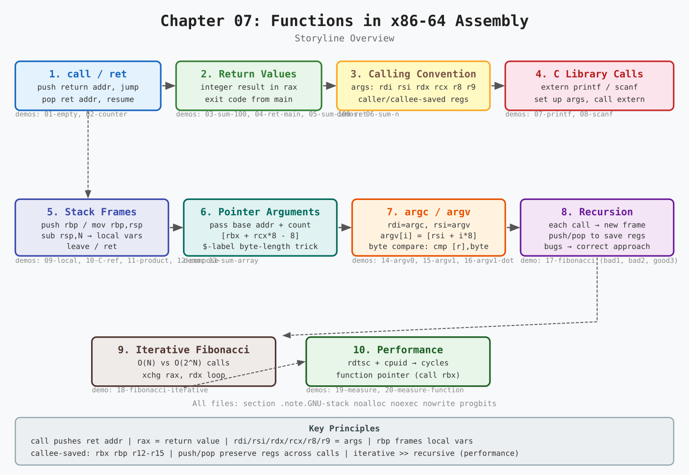
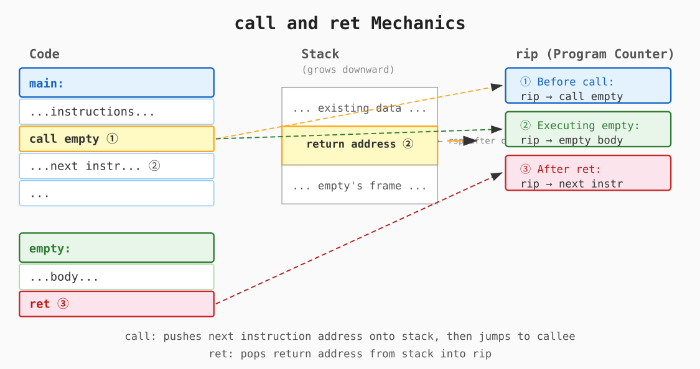
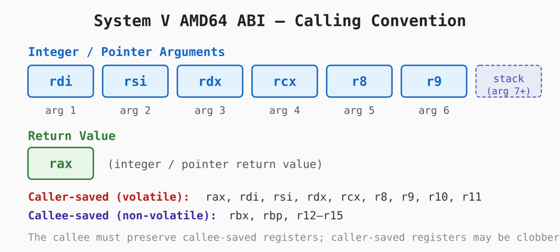
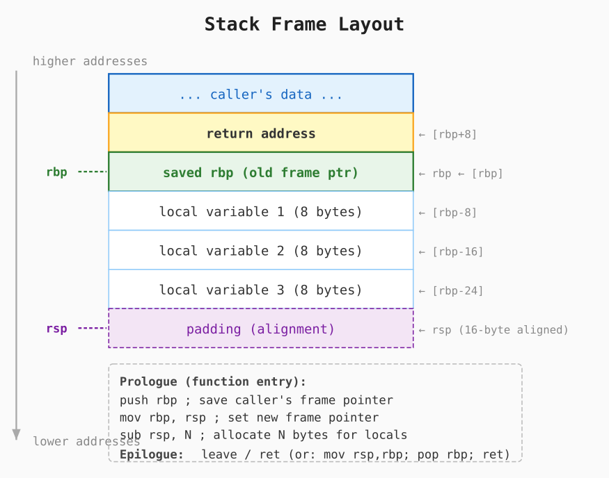
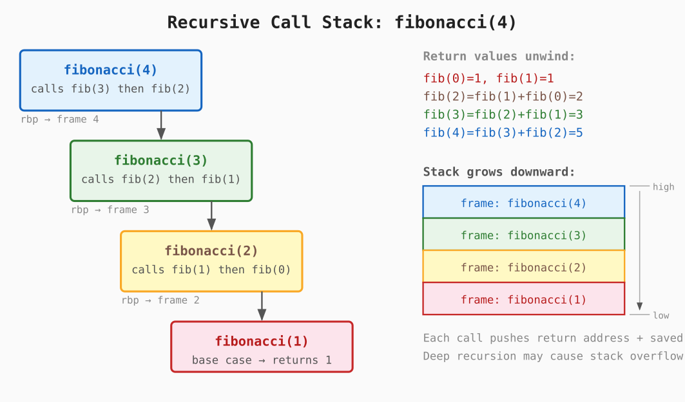

# Chapter 07: Functions in x86-64 Assembly

Functions are the cornerstone of structured programming.
They allow programs to be decomposed into named, reusable units that can be called from multiple places, making code easier to understand, test and maintain.

This chapter walks through the key concepts of functions in x86-64 assembly — from the simplest empty function all the way to recursive algorithms, command-line argument handling, and performance measurement — through 20 progressive demos.



---

## Table of Contents

1. [Why Functions?](#1-why-functions)
1. [call and ret — The Mechanics](#2-call-and-ret--the-mechanics)
1. [Demo 01: Empty Function](#demo-01-empty-function)
1. [Demo 02: Counter — Shared State](#demo-02-counter--shared-state)
1. [Return Values via rax](#3-return-values-via-rax)
1. [Demo 03: Sum of 100 via Global Variable](#demo-03-sum-of-100-via-global-variable)
1. [Demo 04: Return Value from main](#demo-04-return-value-from-main)
1. [Demo 05: Sum of 100 via Return Value](#demo-05-sum-of-100-via-return-value)
1. [Passing Arguments — The Calling Convention](#4-passing-arguments--the-calling-convention)
1. [Demo 06: sum_n — First Function Argument](#demo-06-sum_n--first-function-argument)
1. [Calling C Library Functions](#5-calling-c-library-functions)
1. [Demo 07: Calling printf Directly](#demo-07-calling-printf-directly)
1. [Demo 08: Reading Input with scanf](#demo-08-reading-input-with-scanf)
1. [Stack Frames and Local Variables](#6-stack-frames-and-local-variables)
1. [Demo 09: Local Variable on the Stack](#demo-09-local-variable-on-the-stack)
1. [Demo 10: C Reference Implementation](#demo-10-c-reference-implementation)
1. [Demo 11: Multiple Local Variables](#demo-11-multiple-local-variables)
1. [Demo 12: Composing Functions](#demo-12-composing-functions)
1. [Pointer and Array Arguments](#7-pointer-and-array-arguments)
1. [Demo 13: Sum of Array Elements](#demo-13-sum-of-array-elements)
1. [Command-Line Arguments (argc, argv)](#8-command-line-arguments-argc-argv)
1. [Demo 14: Print argv[0]](#demo-14-print-argv0)
1. [Demo 15: Print argv[1] with Validation](#demo-15-print-argv1-with-validation)
1. [Demo 16: Checking a Character in argv[1]](#demo-16-checking-a-character-in-argv1)
1. [Recursive Functions](#9-recursive-functions)
1. [Demo 17: Recursive Fibonacci — Bugs and Fix](#demo-17-recursive-fibonacci--bugs-and-fix)
1. [Demo 18: Iterative Fibonacci](#demo-18-iterative-fibonacci)
1. [Performance and Measurement](#10-performance-and-measurement)
1. [Demo 19: Measuring with rdtsc](#demo-19-measuring-with-rdtsc)
1. [Demo 20: Higher-Order measure_function](#demo-20-higher-order-measure_function)
1. [Summary](#summary)

---

## 1. Why Functions?

Large programs are hard to understand when written as a single flat sequence of instructions.
Functions address this by:

* **Naming** a piece of logic so it can be referred to and called from multiple places
* **Abstracting** implementation details behind a well-defined interface (arguments and return value)
* **Reusing** the same code without copying it

In assembly, a function is just a label at a known address.
The programmer (or compiler) must follow a calling convention to pass arguments, preserve registers, and return results.

---

## 2. call and ret — The Mechanics

The two fundamental instructions for functions are `call` and `ret`.

```nasm
call target   ; push next instruction address onto stack, then jump to target
ret           ; pop return address from stack into rip, resuming the caller
```



**What `call` does:**

1. Pushes the address of the instruction **after** the `call` (the *return address*) onto the stack — decrements `rsp` by 8, writes the address.
1. Jumps to `target` by loading it into `rip`.

**What `ret` does:**

1. Pops 8 bytes from the stack into `rip` — increments `rsp` by 8.
1. Execution resumes at the return address in the caller.

The call/ret pair is essentially a disciplined `jmp` that remembers where to come back.

---

## Demo 01: Empty Function

**Directory:** [`01-empty/`](01-empty/)

The simplest possible function — it contains only `ret`:

```nasm
empty:
    ret

main:
    push rbp
    mov rbp, rsp

    call empty
    call empty
    call empty

    leave
    ret
```

Even this minimal example shows the full cycle: `main` sets up its stack frame with the `push rbp` / `mov rbp, rsp` prologue, calls `empty` three times, and cleans up with `leave` / `ret`.
Note that `main` itself follows the same calling convention as any other function — it is called by the C runtime (`_start` / `__libc_start_main`) before the program begins.

**Build and run:**

```console
cd 01-empty && make && ./empty
```

Nothing is printed — the function does nothing.

---

## Demo 02: Counter — Shared State

**Directory:** [`02-counter/`](02-counter/)

```nasm
counter:
    inc rcx
    ret

main:
    push rbp
    mov rbp, rsp

    xor rcx, rcx

    call counter
    call counter
    call counter

    PRINTF64 `Counter is: %lu\n\0`, rcx

    leave
    ret
```

The `counter` function increments `rcx`.
Because `rcx` is a **caller-saved** register under the System V ABI the callee is free to modify it — but here `main` explicitly initialises it and reads it back after all three calls.

> **Observation:** relying on register state shared between caller and callee is fragile and non-standard.
> The proper mechanism is to use function arguments and return values (covered in the next sections).

**Output:**

```text
Counter is: 3
```

---

## 3. Return Values via rax

The System V AMD64 ABI specifies that integer and pointer return values are passed back from callee to caller in **`rax`**.

```nasm
; Returns the value 42 in rax.
answer:
    mov rax, 42
    ret

main:
    call answer
    ; rax now contains 42
```

This is the low-level equivalent of `return value;` in C.

---

## Demo 03: Sum of 100 via Global Variable

**Directory:** [`03-sum-100/`](03-sum-100/)

This demo shows a function that computes a result and stores it in a **global variable** in the `.bss` section.

```nasm
section .bss
    sum resq 1          ; 8-byte uninitialised global

sum_100:
    mov rcx, 100
    xor rax, rax
.again:
    add rax, rcx
    loopnz .again
    mov [sum], rax      ; store result in global
    ret

main:
    call sum_100
    PRINTF64 `Sum is: %lu\n\0`, qword [sum]
```

Using a global is the naive approach — it prevents the function from being called concurrently or recursively with independent results.

**Output:** `Sum is: 5050`

---

## Demo 04: Return Value from main

**Directory:** [`04-ret-main/`](04-ret-main/)

`main` is just a function.
Its return value in `rax` becomes the process **exit code** reported to the shell.

```nasm
main:
    push rbp
    mov rbp, rsp

    mov rax, 42

    leave
    ret
```

```console
./ret_main
echo $?
```

Output:

```text
42
```

---

## Demo 05: Sum of 100 via Return Value

**Directory:** [`05-sum-100-ret/`](05-sum-100-ret/)

Instead of storing the result in a global, `sum_100` simply leaves the sum in `rax` and returns:

```nasm
sum_100:
    mov rcx, 100
    xor rax, rax
.again:
    add rax, rcx
    loopnz .again
    ret                  ; sum is already in rax

main:
    call sum_100
    PRINTF64 `Sum is: %lu\n\0`, rax   ; use rax directly
```

This is the idiomatic pattern: the callee computes a value in `rax`; the caller uses it immediately.

**Output:** `Sum is: 5050`

---

## 4. Passing Arguments — The Calling Convention

The System V AMD64 ABI defines which registers carry function arguments:



| Argument | Register |
|----------|----------|
| 1st | `rdi` |
| 2nd | `rsi` |
| 3rd | `rdx` |
| 4th | `rcx` |
| 5th | `r8` |
| 6th | `r9` |
| 7th+ | stack |

**Return value:** `rax` (integer/pointer), `xmm0` (floating-point).

**Caller-saved registers** (the callee may clobber them): `rax`, `rdi`, `rsi`, `rdx`, `rcx`, `r8`, `r9`, `r10`, `r11`.

**Callee-saved registers** (the callee must preserve them): `rbx`, `rbp`, `r12`–`r15`.

---

## Demo 06: sum_n — First Function Argument

**Directory:** [`06-sum-n/`](06-sum-n/)

The function `sum_n` takes `N` as its first argument in `rdi`:

```nasm
section .rodata
    N dq 200

sum_n:
    mov rcx, rdi        ; N from first argument
    xor rax, rax
.again:
    add rax, rcx
    loopnz .again
    ret

main:
    mov rdi, [N]        ; load N into 1st argument register
    call sum_n
    PRINTF64 `Sum is: %lu\n\0`, rax
```

**Output:** `Sum is: 20100`

---

## 5. Calling C Library Functions

Assembly programs can call any C function by:

1. Declaring it `extern`
1. Loading arguments into the correct registers
1. Issuing `call`

```nasm
extern printf
; ...
lea rdi, [format]      ; 1st arg: format string
mov rsi, rax           ; 2nd arg: value
call printf
```

The `printf64.asm` macro used in earlier demos hides this.
Demos 07 onwards call `printf` and `scanf` directly to make the ABI explicit.

### `xor rax, rax` Before `printf` and `scanf`

The System V AMD64 ABI requires that `rax` holds the number of vector (SSE/AVX) registers used for floating-point arguments before any call to a variadic function such as `printf` or `scanf`.
When no floating-point arguments are passed, `rax` must be zero.
Omitting this can cause the callee to read uninitialised XMM registers, leading to undefined behaviour.

The correct pattern is:

```nasm
lea rdi, [format]
mov rsi, value
xor rax, rax            ; no vector register arguments
call printf
```

All assembly files from demo 11 onwards follow this convention.

---

## Demo 07: Calling printf Directly

**Directory:** [`07-sum-n-printf/`](07-sum-n-printf/)

```nasm
section .rodata
    format db "Sum is: %lu", 10, 0

extern printf
global main

main:
    ; ... compute sum in rax via sum_n(200) ...
    lea rdi, [format]
    mov rsi, rax
    call printf
```

`printf` receives the format string in `rdi` and the integer in `rsi` — exactly the first and second argument registers.

---

## Demo 08: Reading Input with scanf

**Directory:** [`08-sum-n-scanf/`](08-sum-n-scanf/)

`scanf` requires a **pointer** to where to store the value — passed in `rsi`:

```nasm
section .bss
    N resq 1

; Read into global N
lea rdi, [scanf_format]   ; "%lu"
lea rsi, [N]              ; address of N
call scanf
```

After `scanf` returns, `[N]` contains the value typed by the user.

---

## 6. Stack Frames and Local Variables

Instead of using global variables, functions allocate **local variables on the stack**.



The standard x86-64 **function prologue** sets up a stack frame:

```nasm
push rbp          ; save caller's frame pointer
mov rbp, rsp      ; establish new frame pointer
sub rsp, N        ; allocate N bytes for local variables
```

Local variables are accessed relative to `rbp`:

* First local (8 bytes): `[rbp-8]`
* Second local (8 bytes): `[rbp-16]`
* ...

The **epilogue** reverses this:

```nasm
leave             ; equivalent to: mov rsp, rbp / pop rbp
ret
```

> **Stack alignment:** The System V ABI requires `rsp` to be 16-byte aligned when a `call` instruction is executed.
> After `push rbp` (which decrements `rsp` by 8) and with an even number of 8-byte local slots, the total adjustment `sub rsp, N` must make `rsp` 16-byte aligned again.
> A common pattern is to allocate in multiples of 16 bytes (e.g., `sub rsp, 16` for one 8-byte variable).

---

## Demo 09: Local Variable on the Stack

**Directory:** [`09-sum-n-local/`](09-sum-n-local/)

```nasm
main:
    push rbp
    mov rbp, rsp
    sub rsp, 16           ; allocate space; N is at [rbp-16]

    lea rdi, [prompt]
    call printf

    lea rdi, [scanf_format]
    lea rsi, [rbp-16]     ; pass address of local N to scanf
    call scanf

    mov rdi, [rbp-16]     ; load N
    call sum_n

    lea rdi, [printf_format]
    mov rsi, rax
    call printf

    leave
    ret
```

The local variable `N` lives at `[rbp-16]`.
Its address is formed with `lea rsi, [rbp-16]` and passed to `scanf`.

---

## Demo 10: C Reference Implementation

**Directory:** [`10-sum-n-scanf-c/`](10-sum-n-scanf-c/)

The equivalent C code helps you see exactly what the compiler does:

```c
static long sum_n(long N)
{
    long i, sum = 0;
    for (i = 1; i <= N; i++)
        sum += i;
    return sum;
}

int main(void)
{
    long N;
    printf("Introduce N: ");
    scanf("%ld", &N);
    printf("Sum is: %ld\n", sum_n(N));
    return 0;
}
```

Compare this with `09-sum-n-local` to see the direct correspondence:

* `long N;` → `sub rsp, 16` + use `[rbp-16]`
* `&N` → `lea rsi, [rbp-16]`
* `return sum;` → value left in `rax`

---

## Demo 11: Multiple Local Variables

**Directory:** [`11-sum-n-product/`](11-sum-n-product/)

When multiple function calls are made and results must be preserved across them, local variables on the stack are essential.
After `call sum_n`, `rax` holds the result — but the next `call sum_n` will overwrite `rax`.
The solution is to save intermediate results to local stack slots:

```nasm
sub rsp, 32          ; N at [rbp-16], sum1 at [rbp-24], sum2 at [rbp-32]

; First sum
mov rdi, [rbp-16]
call sum_n
mov [rbp-24], rax    ; save sum1

; Second sum
mov rdi, [rbp-16]
call sum_n
mov [rbp-32], rax    ; save sum2

; Product
mov rax, [rbp-24]
mul qword [rbp-32]
; result in rax (and rdx for overflow)
```

---

## Demo 12: Composing Functions

**Directory:** [`12-sum-read-compute/`](12-sum-read-compute/)

A helper function `read_compute_sum` encapsulates the read-N / compute-sum pattern.
It itself uses the stack frame prologue/epilogue and allocates a local variable:

```nasm
read_compute_sum:
    push rbp
    mov rbp, rsp
    sub rsp, 16           ; local N at [rbp-16]

    lea rdi, [prompt]
    call printf
    lea rdi, [scanf_format]
    lea rsi, [rbp-16]
    call scanf
    mov rdi, [rbp-16]
    call sum_n

    leave
    ret                   ; result in rax
```

`main` calls it twice:

```nasm
call read_compute_sum
mov [rbp-8], rax         ; save sum1

call read_compute_sum
mov [rbp-16], rax        ; save sum2
```

This shows how any non-leaf function needs its own proper stack frame.

---

## 7. Pointer and Array Arguments

To pass an array to a function, pass a **pointer to its first element** and the **element count** as separate arguments:

```c
unsigned long sum_array(unsigned long *a, size_t num_items);
```

In assembly:

* `rdi` = base address of the array
* `rsi` = number of elements

---

## Demo 13: Sum of Array Elements

**Directory:** [`13-sum-array/`](13-sum-array/)

```nasm
section .rodata
    num_array dq 10, 20, 30, 40, 50, 60, 70, 80
    len equ $-num_array    ; total byte length

sum_array:
    mov rbx, rdi           ; base pointer
    mov rcx, rsi           ; count
    xor rax, rax
.again:
    add rax, [rbx + rcx*8 - 8]   ; access element [count-1] down to [0]
    loopnz .again
    ret

main:
    mov rdi, num_array
    mov rsi, len
    shr rsi, 3             ; convert byte count -> element count (div 8)
    call sum_array
    ; rax = 360
```

Note: `$-num_array` computes the byte size of the array at assembly time.
Shifting right by 3 (dividing by 8) converts bytes to 64-bit element count.

**Output:** `Sum of items in array is: 360`

---

## 8. Command-Line Arguments (argc, argv)

In the System V ABI, `main` is called with:

* `rdi` = `argc` (number of arguments, including program name)
* `rsi` = `argv` (pointer to a null-terminated array of C string pointers)

```text
argv -> [ ptr0 | ptr1 | ptr2 | NULL ]
           |      |      |
         "prog" "arg1" "arg2"
```

In memory:

* `argv[0]` = `[rsi]`
* `argv[1]` = `[rsi+8]`
* `argv[i]` = `[rsi + i*8]`

---

## Demo 14: Print argv[0]

**Directory:** [`14-print-argv0/`](14-print-argv0/)

```nasm
main:
    push rbp
    mov rbp, rsp

    ; rsi = argv, dereference to get argv[0]
    mov rsi, [rsi]

    lea rdi, [printf_format]
    call printf
```

```console
./print_argv0
```

Output (exact path depends on how the binary is invoked):

```text
argv[0] is ./print_argv0
```

---

## Demo 15: Print argv[1] with Validation

**Directory:** [`15-print-argv1/`](15-print-argv1/)

```nasm
    cmp rdi, 2            ; check argc == 2
    jne .improper_num_args

    mov rsi, [rsi+8]      ; argv[1] = second element of argv array
    lea rdi, [printf_format]
    call printf
```

This introduces argument count checking and error branches.

```console
./print_argv1 hello
```

Output:

```text
argv[1] is hello
```

---

## Demo 16: Checking a Character in argv[1]

**Directory:** [`16-print-argv1-dot/`](16-print-argv1-dot/)

After loading `argv[1]` into `rsi`, its first byte is compared against `'.'`:

```nasm
    cmp [rsi], byte '.'
    jne .not_dot
```

This shows how to dereference a pointer and test a single byte.

```console
./print_argv1_dot .hidden
```

Output:

```text
argv[1] is .hidden
```

```console
./print_argv1_dot hello
```

Output:

```text
argv[1] doesn't start with a . (dot)
```

---

## 9. Recursive Functions

A function is **recursive** when it calls itself.
In x86-64 assembly, recursion works automatically because each `call` creates a new stack frame — each invocation has its own return address and local variables.



The key challenge is **preserving register values across recursive calls**.

The Fibonacci function demonstrates this:

```text
fib(N) = 1                     if N < 2
fib(N) = fib(N-1) + fib(N-2)  if N >= 2
```

To compute `fib(N-1)` the function must:

1. Save `N` (in `rdi`) before decrementing it for the first call
1. After the first call returns, restore `N` so it can compute `N-2` for the second call
1. Save the result of `fib(N-1)` before the second call overwrites `rax`

---

## Demo 17: Recursive Fibonacci — Bugs and Fix

**Directory:** [`17-fibonacci/`](17-fibonacci/)

Three versions illustrate common mistakes:

**Bad 1 (`fibonacci_bad1.asm`):** `rdi` is not saved before the first recursive call.
`rdi` is a caller-saved register, so after the call returns it contains whatever the callee left there.
The second `dec rdi` then decrements that clobbered value instead of `N-1`, giving wrong results.

**Bad 2 (`fibonacci_bad2.asm`):** Tries to fix this by pushing `rdi` and popping into `rdi` — but pops it *before* saving `rax`, overwriting the result.

**Good (`fibonacci_good3.asm`):**

```nasm
fibonacci:
    cmp rdi, 2
    jge .continue
    mov rax, 1
    jmp .out

.continue:
    dec rdi
    push rdi          ; save N-1 (original N decremented once)
    call fibonacci    ; compute fib(N-1)
    pop rdi           ; restore rdi = N-1

    push rax          ; save fib(N-1) result

    dec rdi           ; rdi = N-2
    call fibonacci    ; compute fib(N-2)

    pop rdx           ; rdx = fib(N-1)
    add rax, rdx      ; rax = fib(N) = fib(N-1) + fib(N-2)
.out:
    ret
```

The critical insight: **pop `rdi` after the first call (before saving `rax`) so you have the correct `N-1` to compute `N-2`.**

---

## Demo 18: Iterative Fibonacci

**Directory:** [`18-fibonacci-iterative/`](18-fibonacci-iterative/)

Recursive Fibonacci has exponential time complexity — `fib(N)` makes `O(2^N)` calls.
The iterative version computes the same result in `O(N)` steps with no recursion:

```nasm
fibonacci_iterative:
    cmp rdi, 2
    jge .continue
    mov rax, 1
    jmp .out

.continue:
    mov rax, 1        ; fib(1)
    mov rdx, 1        ; fib(2)
    mov rcx, rdi
    sub rcx, 1        ; loop N-1 times
.again:
    xchg rax, rdx     ; rotate: rdx = prev, rax = prev-prev
    add rax, rdx      ; rax = fib(k) = fib(k-1) + fib(k-2)
    loop .again
.out:
    ret
```

No `call`, no stack growth — the same `rax`/`rdx` pair is updated in place.

---

## 10. Performance and Measurement

The x86-64 `rdtsc` instruction reads the CPU's **Time-Stamp Counter** — a 64-bit register that counts processor cycles since reset.

```nasm
cpuid           ; serialize execution (prevent out-of-order execution)
rdtsc           ; result in edx:eax (high 32 bits in rdx, low 32 in rax)
shl rdx, 32
or  rax, rdx   ; combine into full 64-bit value
```

By reading the TSC before and after a function call and subtracting, you get the CPU cycle count for that call.

---

## Demo 19: Measuring with rdtsc

**Directory:** [`19-fibonacci-measure/`](19-fibonacci-measure/)

The program measures both implementations for the same `N`:

```nasm
cpuid
rdtsc
shl rdx, 32
or rax, rdx
mov [rbp-24], rax          ; start_time

mov rdi, [rbp-16]
call fibonacci_iterative

rdtsc
shl rdx, 32
or rax, rdx
mov [rbp-32], rax          ; end_time

mov rax, [rbp-32]
sub rax, [rbp-24]          ; elapsed cycles
```

For `N=30`:

```text
Iterative cycles: ~300
Recursive cycles: ~5000000
```

The recursive version is thousands of times slower.

---

## Demo 20: Higher-Order measure_function

**Directory:** [`20-fibonacci-measure-function/`](20-fibonacci-measure-function/)

The measurement logic is factored into a reusable helper that takes a **function pointer**:

```nasm
; measure_function(fn_ptr, arg) -> elapsed cycles in rax
measure_function:
    push rbp
    mov rbp, rsp
    sub rsp, 16

    cpuid
    rdtsc
    shl rdx, 32
    or rax, rdx
    mov [rbp-8], rax       ; start_time

    mov rbx, rdi           ; save function pointer in callee-saved rbx
    mov rdi, rsi           ; arg becomes 1st argument to fn
    call rbx               ; indirect call through register

    rdtsc
    shl rdx, 32
    or rax, rdx
    sub rax, [rbp-8]       ; elapsed cycles

    leave
    ret
```

`main` calls it as:

```nasm
mov rdi, fibonacci_iterative    ; function pointer
mov rsi, [rbp-16]               ; N
call measure_function
```

Key points:

* `call rbx` is an **indirect call** — the target is the value in `rbx`, not a fixed label
* `rbx` is used (instead of `rdi`) because it is **callee-saved** — it survives the `call rbx` itself

---

## Summary

The 20 demos cover the complete lifecycle of functions in x86-64 assembly:

| Demo | Concept |
|------|---------|
| `01-empty` | `call` / `ret` pair, stack frame prologue/epilogue |
| `02-counter` | Calling a function multiple times, shared register state |
| `03-sum-100` | Function with no arguments, result via global |
| `04-ret-main` | Return value in `rax`, exit code |
| `05-sum-100-ret` | Idiomatic return value via `rax` |
| `06-sum-n` | First argument in `rdi` |
| `07-sum-n-printf` | Calling `printf` directly (ABI explicit) |
| `08-sum-n-scanf` | Calling `scanf`, passing a pointer |
| `09-sum-n-local` | Local variable on the stack, `[rbp-N]` addressing |
| `10-sum-n-scanf-c` | C reference: compare C code with assembly |
| `11-sum-n-product` | Multiple local variables, preserving results across calls |
| `12-sum-read-compute` | Helper function with its own stack frame |
| `13-sum-array` | Pointer + count arguments, array access |
| `14-print-argv0` | `argc`/`argv`, dereferencing `argv[0]` |
| `15-print-argv1` | `argc` check, `argv[1]` |
| `16-print-argv1-dot` | Single-byte comparison via pointer dereference |
| `17-fibonacci` | Recursive functions, push/pop for register preservation, common bugs |
| `18-fibonacci-iterative` | Iterative alternative, `xchg`, no stack growth |
| `19-fibonacci-measure` | `rdtsc` / `cpuid` cycle counting |
| `20-fibonacci-measure-function` | Function pointer argument, indirect `call reg` |

### Key Takeaways

* **`call` pushes the return address; `ret` pops it** — this is all that connects caller to callee at the instruction level.
* **The System V AMD64 ABI** defines argument registers (`rdi`, `rsi`, `rdx`, `rcx`, `r8`, `r9`), the return register (`rax`), and which registers each side must preserve.
* **The stack frame** (`push rbp` / `mov rbp, rsp` / `sub rsp, N`) gives each function call its own private space for local variables, accessed as `[rbp-offset]`.
* **Recursive functions** work naturally in assembly — each call gets a fresh frame — but register values must be explicitly saved to the stack before a sub-call that would overwrite them.
* **Iterative implementations** avoid the overhead of deep recursion by replacing the call stack with a simple loop.
* **Function pointers** are ordinary 64-bit values; `call reg` performs an indirect call through the value stored in a register.


