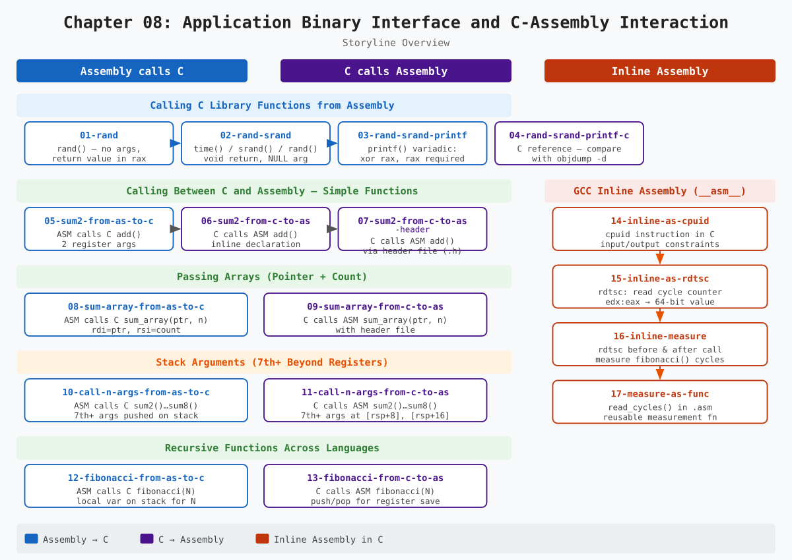
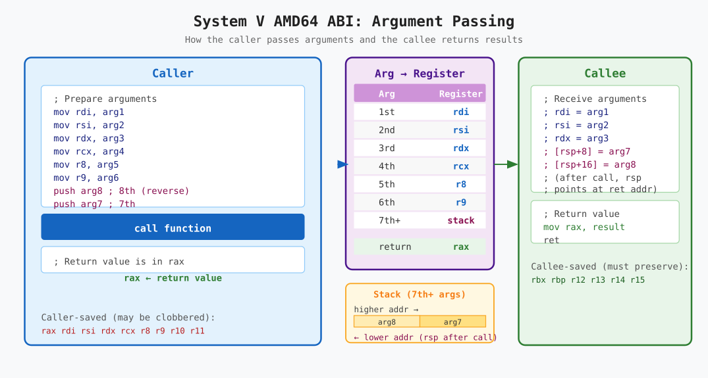
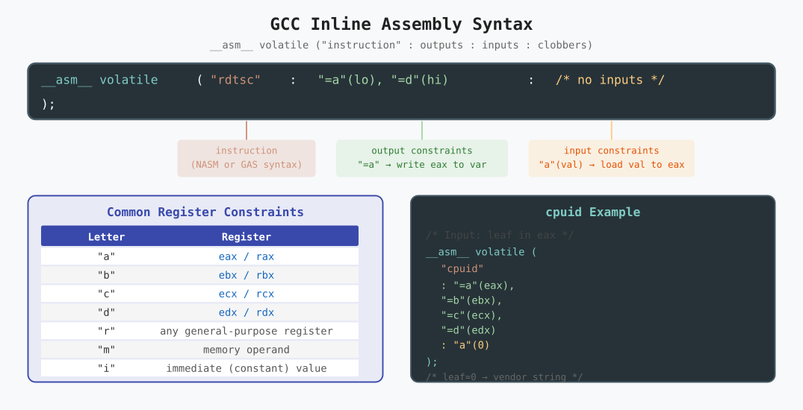

# Chapter 08: Application Binary Interface and C-Assembly Interaction

The Application Binary Interface (ABI) defines the low-level contract between separately compiled program components — how functions are called, how arguments and return values are exchanged, which registers each side must preserve, and how the stack is managed.

This chapter focuses on the **System V AMD64 ABI** used on Linux x86-64 and demonstrates how assembly and C code can call each other seamlessly through 17 progressive demos.



---

## Table of Contents

1. [The Application Binary Interface](#1-the-application-binary-interface)
1. [Calling Convention Summary](#2-calling-convention-summary)
1. [Demo 01: Call rand()](#demo-01-call-rand)
1. [Demo 02: Call srand() and rand()](#demo-02-call-srand-and-rand)
1. [Demo 03: Call srand(), rand(), and printf()](#demo-03-call-srand-rand-and-printf)
1. [Demo 04: C Reference — Disassembly Comparison](#demo-04-c-reference--disassembly-comparison)
1. [Calling Between C and Assembly](#3-calling-between-c-and-assembly)
1. [Demo 05: Assembly Calls C add()](#demo-05-assembly-calls-c-add)
1. [Demo 06: C Calls Assembly add()](#demo-06-c-calls-assembly-add)
1. [Demo 07: C Calls Assembly add() (with Header File)](#demo-07-c-calls-assembly-add-with-header-file)
1. [Passing Arrays Across Languages](#4-passing-arrays-across-languages)
1. [Demo 08: Assembly Calls C sum_array()](#demo-08-assembly-calls-c-sum_array)
1. [Demo 09: C Calls Assembly sum_array()](#demo-09-c-calls-assembly-sum_array)
1. [Functions with More Than Six Arguments](#5-functions-with-more-than-six-arguments)
1. [Demo 10: Assembly Calls C sum2()–sum8()](#demo-10-assembly-calls-c-sum2sum8)
1. [Demo 11: C Calls Assembly sum2()–sum8()](#demo-11-c-calls-assembly-sum2sum8)
1. [Recursive Functions Across Languages](#6-recursive-functions-across-languages)
1. [Demo 12: Assembly Calls C fibonacci()](#demo-12-assembly-calls-c-fibonacci)
1. [Demo 13: C Calls Assembly fibonacci()](#demo-13-c-calls-assembly-fibonacci)
1. [Inline Assembly](#7-inline-assembly)
1. [Demo 14: Inline cpuid](#demo-14-inline-cpuid)
1. [Demo 15: Inline rdtsc](#demo-15-inline-rdtsc)
1. [Demo 16: Measuring with Inline rdtsc](#demo-16-measuring-with-inline-rdtsc)
1. [Demo 17: read_cycles() in a Separate Assembly File](#demo-17-read_cycles-in-a-separate-assembly-file)
1. [Summary](#summary)

---

## 1. The Application Binary Interface

When two separately compiled modules (e.g. a `.c` file and a `.asm` file) are linked together and one calls a function in the other, they must agree on:

* **Which registers hold arguments** — so the caller loads registers the callee will read.
* **Which register holds the return value** — so the callee writes it and the caller reads it.
* **Which registers each side may freely modify** (*caller-saved*) and which must be left unchanged (*callee-saved*).
* **Stack alignment** — `rsp` must be 16-byte aligned at the point of a `call` instruction.
* **Stack argument layout** — when there are more than six arguments, the extras are placed on the stack in a defined order.

This contract is the **System V AMD64 ABI**, the standard for Linux x86-64.

---

## 2. Calling Convention Summary



### Argument Registers

| Argument | Register |
|----------|----------|
| 1st | `rdi` |
| 2nd | `rsi` |
| 3rd | `rdx` |
| 4th | `rcx` |
| 5th | `r8` |
| 6th | `r9` |
| 7th+ | stack (right-to-left, i.e. pushed in reverse order) |

### Return Value

Integer and pointer return values are passed in **`rax`**.

### Register Preservation

**Caller-saved** (the callee may overwrite these freely):
`rax`, `rdi`, `rsi`, `rdx`, `rcx`, `r8`, `r9`, `r10`, `r11`

**Callee-saved** (the callee must save and restore these if it uses them):
`rbx`, `rbp`, `r12`, `r13`, `r14`, `r15`

### Variadic Functions (`printf`, `scanf`)

Before calling a variadic function, **`rax` must be set to the number of floating-point arguments** passed in vector (XMM/YMM) registers.
When no floating-point arguments are passed, use:

```nasm
xor rax, rax    ; 0 floating-point arguments
call printf
```

---

## Demo 01: Call rand()

**Directory:** [`01-rand/`](01-rand/)

The simplest possible call: `rand()` takes no arguments and returns a value in `rax`.

```nasm
call rand               ; rax = random number

lea rdi, [printf_format]
mov rsi, rax
xor rax, rax
call printf
```

**Build and run:**

```console
cd 01-rand && make && ./rand
```

Output: `Random number: 1804289383` (fixed — no seed set)

---

## Demo 02: Call srand() and rand()

**Directory:** [`02-rand-srand/`](02-rand-srand/)

Chains `time()` → `srand()` → `rand()`, showing three different call patterns:

```nasm
xor rdi, rdi            ; NULL → time(NULL)
call time               ; rax = epoch time

mov rdi, rax            ; seed → srand(seed) — returns void
call srand

call rand               ; rax = seeded random number
```

**Build and run:**

```console
cd 02-rand-srand && make && ./rand_srand
```

---

## Demo 03: Call srand(), rand(), and printf()

**Directory:** [`03-rand-srand-printf/`](03-rand-srand-printf/)

Extends demo 02 to also call `printf()`.
Key point: `xor rax, rax` is required before every call to a variadic function.

**Build and run:**

```console
cd 03-rand-srand-printf && make && ./rand_srand_printf
```

---

## Demo 04: C Reference — Disassembly Comparison

**Directory:** [`04-rand-srand-printf-c/`](04-rand-srand-printf-c/)

The identical program written in C.
Disassemble it to compare with the hand-written assembly:

```console
cd 04-rand-srand-printf-c && make
objdump -d -M intel rand_srand_printf | grep -A 30 '<main>'
```

---

## 3. Calling Between C and Assembly

The linker treats object files identically regardless of whether they were compiled from C or assembled from NASM.
As long as a function's symbol is `global` (in assembly) or declared with proper prototype (in C), and both sides follow the System V ABI, the call succeeds.

---

## Demo 05: Assembly Calls C add()

**Directory:** [`05-sum2-from-as-to-c/`](05-sum2-from-as-to-c/)

`add.c` provides `long add(long a, long b)`.
`main.asm` calls it:

```nasm
extern add

mov rdi, 2
mov rsi, 3
call add        ; rax = 5
```

**Build and run:**

```console
cd 05-sum2-from-as-to-c && make && ./sum2
```

Output: `Sum is: 5`

---

## Demo 06: C Calls Assembly add()

**Directory:** [`06-sum2-from-c-to-as/`](06-sum2-from-c-to-as/)

`add.asm` implements `add` following the ABI.
`main.c` calls it with an inline declaration:

```c
long add(long a, long b);
printf("Sum is: %ld\n", add(2, 3));
```

**Build and run:**

```console
cd 06-sum2-from-c-to-as && make && ./sum2
```

---

## Demo 07: C Calls Assembly add() (with Header File)

**Directory:** [`07-sum2-from-c-to-as-header/`](07-sum2-from-c-to-as-header/)

Same as demo 06 but the declaration is in `add.h`.
This is best practice — all callers `#include "add.h"` instead of redeclaring the function.

**Build and run:**

```console
cd 07-sum2-from-c-to-as-header && make && ./sum2
```

---

## 4. Passing Arrays Across Languages

An array is passed as two arguments: a **pointer to the first element** (`rdi`) and the **element count** (`rsi`).
Neither C nor assembly has any built-in way to determine the length of an array from a pointer alone.

---

## Demo 08: Assembly Calls C sum_array()

**Directory:** [`08-sum-array-from-as-to-c/`](08-sum-array-from-as-to-c/)

```nasm
mov rdi, num_array          ; pointer to array
mov rsi, len                ; number of elements
call sum_array              ; rax = sum
```

**Build and run:**

```console
cd 08-sum-array-from-as-to-c && make && ./sum_array
```

Output: `Sum of array elements is: 360`

---

## Demo 09: C Calls Assembly sum_array()

**Directory:** [`09-sum-array-from-c-to-as/`](09-sum-array-from-c-to-as/)

```c
#include "sum_array.h"
result = sum_array(num_array, sizeof(num_array) / sizeof(num_array[0]));
```

**Build and run:**

```console
cd 09-sum-array-from-c-to-as && make && ./sum_array
```

---

## 5. Functions with More Than Six Arguments

The first six integer arguments go in registers; the seventh and beyond are placed on the stack.
The caller pushes them in **reverse order** (last argument first) so that argument 7 is at `[rsp+8]` after the `call` pushes the return address.

---

## Demo 10: Assembly Calls C sum2()–sum8()

**Directory:** [`10-call-n-args-from-as-to-c/`](10-call-n-args-from-as-to-c/)

Shows the full register sequence plus stack placement for 7 and 8 arguments:

```nasm
push qword 8            ; 8th argument (pushed first)
push qword 7            ; 7th argument
mov rdi, 1
; ... rsi=2, rdx=3, rcx=4, r8=5, r9=6 ...
call sum8
add rsp, 16             ; clean up the two stack arguments
```

**Build and run:**

```console
cd 10-call-n-args-from-as-to-c && make && ./call_n_args
```

---

## Demo 11: C Calls Assembly sum2()–sum8()

**Directory:** [`11-call-n-args-from-c-to-as/`](11-call-n-args-from-c-to-as/)

The assembly `sum7` and `sum8` access stack arguments at `[rsp+8]` and `[rsp+16]` because the return address occupies `[rsp+0]`:

```nasm
sum8:
    mov rax, rdi
    add rax, rsi
    ; ... rdx, rcx, r8, r9 ...
    add rax, [rsp+8]    ; 7th argument
    add rax, [rsp+16]   ; 8th argument
    ret
```

**Build and run:**

```console
cd 11-call-n-args-from-c-to-as && make && ./call_n_args
```

---

## 6. Recursive Functions Across Languages

Recursive functions work across language boundaries without any special treatment — the ABI is followed by each individual call, and the call stack grows and unwinds normally.

---

## Demo 12: Assembly Calls C fibonacci()

**Directory:** [`12-fibonacci-from-as-to-c/`](12-fibonacci-from-as-to-c/)

`main.asm` uses a local stack variable to hold N between calls to `printf`/`scanf` and `fibonacci`:

```nasm
sub rsp, 16         ; N at [rbp-16]
; ... scanf into [rbp-16] ...
mov rdi, [rbp-16]
call fibonacci      ; rax = fibonacci(N)
```

**Build and run:**

```console
cd 12-fibonacci-from-as-to-c && make
echo 10 | ./fibonacci
```

Output: `Fibonacci(10) = 89`

---

## Demo 13: C Calls Assembly fibonacci()

**Directory:** [`13-fibonacci-from-c-to-as/`](13-fibonacci-from-c-to-as/)

The assembly `fibonacci` saves `rdi` and `rax` on the stack at each level of recursion:

```nasm
.continue:
    dec rdi
    push rdi            ; save N-1
    call fibonacci      ; compute fibonacci(N-1)
    pop rdi             ; restore N-1

    push rax            ; save fibonacci(N-1)
    dec rdi
    call fibonacci      ; compute fibonacci(N-2)

    pop rdx
    add rax, rdx        ; fibonacci(N) = fibonacci(N-1) + fibonacci(N-2)
```

**Build and run:**

```console
cd 13-fibonacci-from-c-to-as && make
echo 10 | ./fibonacci
```

---

## 7. Inline Assembly

GCC provides `__asm__` to embed assembly instructions directly inside C source.
This is useful for accessing CPU instructions not exposed by C (such as `cpuid` and `rdtsc`).



The general form is:

```c
__asm__ volatile (
    "instruction"
    : output_constraints
    : input_constraints
    : clobbered_registers
);
```

---

## Demo 14: Inline cpuid

**Directory:** [`14-inline-as-cpuid/`](14-inline-as-cpuid/)

```c
__asm__ volatile (
    "cpuid"
    : "=a"(eax), "=b"(ebx), "=c"(ecx), "=d"(edx)
    : "a"(0)
);
```

`"=a"(eax)` means: write the `eax` register into C variable `eax` after the instruction.
`"a"(0)` means: load the value `0` into `eax` before the instruction.

**Build and run:**

```console
cd 14-inline-as-cpuid && make && ./cpuid
```

Output (on an Intel processor): `Vendor: GenuineIntel`

---

## Demo 15: Inline rdtsc

**Directory:** [`15-inline-as-rdtsc/`](15-inline-as-rdtsc/)

```c
uint32_t lo, hi;
__asm__ volatile ("rdtsc" : "=a"(lo), "=d"(hi));
uint64_t tsc = ((uint64_t)hi << 32) | lo;
```

`rdtsc` writes the 64-bit Time-Stamp Counter into `edx:eax`.
The two halves are then combined in C.

**Build and run:**

```console
cd 15-inline-as-rdtsc && make && ./rdtsc
```

---

## Demo 16: Measuring with Inline rdtsc

**Directory:** [`16-inline-measure/`](16-inline-measure/)

Read the TSC before and after `fibonacci(N)` and subtract to get elapsed cycles:

```c
uint64_t start = read_tsc();
fibonacci(N);
uint64_t end   = read_tsc();
printf("fibonacci(%lu) took %lu cycles\n", N, end - start);
```

**Build and run:**

```console
cd 16-inline-measure && make
echo 10 | ./measure
```

---

## Demo 17: read_cycles() in a Separate Assembly File

**Directory:** [`17-measure-as-func/`](17-measure-as-func/)

The inline assembly is factored into a reusable `read_cycles()` function in `read_cycles.asm`:

```nasm
read_cycles:
    rdtsc               ; edx:eax = timestamp counter
    shl rdx, 32
    or rax, rdx         ; combine into 64-bit rax
    ret
```

C code calls it like any other function:

```c
#include "read_cycles.h"

uint64_t start = read_cycles();
fibonacci(N);
uint64_t end   = read_cycles();
```

**Build and run:**

```console
cd 17-measure-as-func && make
echo 10 | ./measure
```

---

## Summary

| Demo | Direction | Concept |
|------|-----------|---------|
| `01-rand` | ASM → C lib | No-argument call; return value in `rax` |
| `02-rand-srand` | ASM → C lib | `void` return; `NULL` argument; chained calls |
| `03-rand-srand-printf` | ASM → C lib | Variadic call; `xor rax, rax` before `printf` |
| `04-rand-srand-printf-c` | C reference | Disassembly comparison with hand-written ASM |
| `05-sum2-from-as-to-c` | ASM → C | Two-argument call; `extern` declaration |
| `06-sum2-from-c-to-as` | C → ASM | `global` symbol; inline declaration |
| `07-sum2-from-c-to-as-header` | C → ASM | Header file best practice |
| `08-sum-array-from-as-to-c` | ASM → C | Array as pointer + count |
| `09-sum-array-from-c-to-as` | C → ASM | Assembly array traversal |
| `10-call-n-args-from-as-to-c` | ASM → C | 7th and 8th args pushed on stack (reversed) |
| `11-call-n-args-from-c-to-as` | C → ASM | Stack args at `[rsp+8]`, `[rsp+16]` |
| `12-fibonacci-from-as-to-c` | ASM → C | Recursive call; local var to preserve N |
| `13-fibonacci-from-c-to-as` | C → ASM | Recursive ASM; push/pop for register save |
| `14-inline-as-cpuid` | Inline | `__asm__` with input/output constraints |
| `15-inline-as-rdtsc` | Inline | `rdtsc`; `edx:eax` → 64-bit value |
| `16-inline-measure` | Inline | TSC before/after measurement |
| `17-measure-as-func` | C → ASM | `rdtsc` factored into reusable ASM function |

### Key Takeaways

* **The System V AMD64 ABI** is the shared contract that makes C and assembly code interoperable on Linux x86-64.
* **Argument registers** (`rdi`, `rsi`, `rdx`, `rcx`, `r8`, `r9`) and the **return register** (`rax`) are the same regardless of whether the caller or callee is written in C or assembly.
* **Arguments beyond the sixth** are placed on the stack, pushed in reverse order; the callee accesses them at `[rsp+8]`, `[rsp+16]`, … (because `[rsp+0]` holds the return address).
* **Caller-saved registers** may be freely overwritten by the callee; **callee-saved registers** must be preserved.
* **Variadic functions** (`printf`, `scanf`) require `rax = 0` before the call to indicate no floating-point arguments.
* **Header files** are the correct mechanism for sharing function declarations between C and assembly; they prevent mismatches and make maintenance easier.
* **Inline assembly** (`__asm__`) allows individual CPU instructions to be used from within C code without a separate assembly file, at the cost of using GCC's constraint syntax instead of plain NASM.


