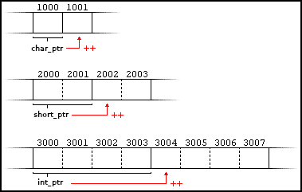
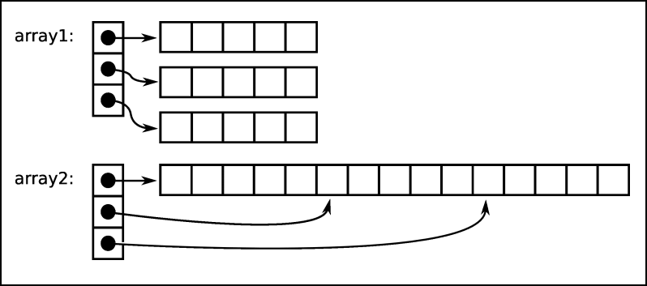
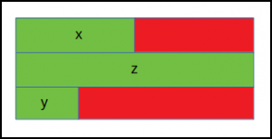

# **Laborator 02: Operații cu memoria. Introducere în GDB**

În acest laborator vom înțelege modul în care datele sunt organizate în memorie, noțiunea de pointer și modurile în care se poate interacționa cu memoria, felul în care pointerii sunt folosiți pentru a returna sau a modifica parametri în cadrul unei funcții, cât și noțiunea de pointer la o funcție și folosirea acesteia în situații necesare. De asemenea, laboratorul vizează introducerea într-un utilitar de analiză dinamică, și anume GDB.

## **Pointeri**

În limbajul C interacțiunea cu memoria se realizează prin intermediul pointerilor. Reamintim că un pointer este o variabilă ce reține o adresă de memorie. Forma generală de declarare este urmatoarea: `tip *nume_variabilă`, unde `nume_variabilă` reprezintă orice tip de date valid din C.

> **WARNING:** **Asteriscul(`*`)** folosit la declararea unui pointer denotă faptul ca acesta este un pointer și nu trebuie confundat cu operatorul de dereferențiere, fiind două concepte total diferite reprezentate cu același simbol.
> Declararea unui pointer nu înseamnă alocarea unei zone de memorie în care pot fi stocate date. Un pointer este tot un tip de date, a cărui valoare este un număr ce reprezintă o adresă de memorie.
> ```c
>   int *p = 0xCAFEBABE; /* Declararea unui pointer */
>   int x = *p; /* Valoarea de la adresa conținută de p. */
> ```

 În C un pointer poate reprezenta:
 -  Adresa unor date de un anume tip
 -  Adresa unei zone de memorie
 -  Adresa unei funcții
 -  Adresa unei zone cu conținut necunoscut (pointer la void)

 > **TIP:** Dimensiunea unui pointer depinde de arhitectura și sistemul de operare pe care a fost compilat programul. Dimensiunea unui pointer se determină cu `sizeof(void*)` și nu este în mod necesar egală cu dimensiunea unui `int`.

### **Pointeri la void**

Un pointer la void este un pointer care nu are un tip asociat. Pointerii la void au o flexibilitate mare deoarece pot pointa la orice tip de date, dar au și o limitare la fel de mare, și anume că nu pot fi dereferențiați, iar pentru a putea fi folosiți în operații cu pointeri trebuie convertiți la un tip de date cunoscut.

Cel mai adesea sunt folosiți în implementarea de funcții generice. De exemplu, funcțiile `malloc()` și `calloc()` returnează un pointer la void ceea ce permite ca aceste funcții să fie folosite pentru alocarea de memorie pentru orice tip de date.

Un exemplu de folosire a pointerilor la void este următorul:

```c
#include <stdio.h>

void increment(void *data, int element_size) {
    /* Se verifică dacă data introdusă este un char */
	if (element_size == sizeof(char)) {
        /* După cum am precizat, pentru a putea fi dereferențiat,
        *  un pointer la void trebuie castat
        */
		char *char_ptr = data;
 		++(*char_ptr);
	}

	if (element_size == sizeof(int)) {
		int *int_ptr = data;
		++(*int_ptr);
	}
}

int main() {
	char c = 'a';
	int x = 10;

	increment(&c, sizeof(c));
	increment(&x, sizeof(x));

	printf("%c, %d\n", c, x); /* Va avea ca rezultat: b, 11 */
	return 0;
}
```

### **Operații cu pointeri. Aritmetica pointerilor**

Operațiile aritmetice pe pointeri sunt puțin diferite de cele pe tipurile de date întregi. Singurele operații valide sunt **incrementarea** sau **decrementarea** unui pointer, **adunarea** sau **scăderea** unui întreg la un pointer, respectiv scăderea a doi pointeri de **același tip**, iar comportamentul acestor operații este influențat de tipul de date la care pointerii se referă.

Prin incrementarea unui pointer legat la un tip de date `T`, adresa nu este crescută cu 1, ci cu valoarea `sizeof(T)` care asigură adresarea urmatorului obiect de același tip. În mod similar, adunarea unui întreg `n` la un pointer `p` (deci operația `p + n`) reprezintă de fapt `p + n * sizeof(*p)`. De exemplu:

```c
char *char_ptr = 1000;
short *short_ptr = 2000;
int *int_ptr = 3000;

++char_ptr; /* Așa cum ne așteptăm char_ptr va pointa la adresa 1001 */
++short_ptr; /* short_ptr pointează la adresa 2002 */
++int_ptr; /* int_ptr pointează la adresa 3004 */
```



Scăderea a doi pointeri este posibilă doar dacă ambii au același tip. Rezultatul scăderii este obținut prin calcularea diferenței adreselor de memorie către care pointează. Spre exemplu, calcularea lungimii unui șir de caractere:

```c
char *s = "Learn IOCLA, you must!";
char *p = s;
for (; *p; ++p); /* Se iterează caracter cu caracter, până la '\0' */

printf("%ld", p - s); /* Se va afișa 22. */
```
#### **Interpretarea datelor din memorie**
Pe cele mai multe calculatoare moderne, cea mai mică unitate de date care poate fi adresată este `byte-ul/octetul` (8 biți), acest lucru însemnând că putem privi datele în memorie drept o înșiruire de bytes, fiecăruia corespunzându-i o adresă. Așa cum s-a menționat în [laboratorul trecut](https://ocw.cs.pub.ro/courses/iocla/laboratoare/laborator-01), în cazul în care dorim să stocăm o informație reprezentată pe mai mulți octeți va trebui să ținem cont de ordinea impusă de arhitectura sistemului, denumită [endianness](https://en.wikipedia.org/wiki/Endianness). Mai jos se poate observa mecanismul de extragere a datelor din memorie pe o arhitectură **little-endian**:
```c
int n = 0xCAFEBABE;
unsigned char first_byte = *((unsigned char*) &n); /* Se extrage primul byte al lui n */
unsigned char second_byte = *((unsigned char*) &n + 1); /* Se extrage al doilea byte al lui n */
printf("0x%x, 0x%x\n", first_byte, second_byte); /* Se va afișa 0xBE, 0xBA */
```

> **NOTE:** În cazul pointerilor castați, operațiile aritmetice se realizează pe tipul la care aceștia au fost castați.

> **WARNING:** Nu faceți confuzie intre `*p++` și `(*p)++`. În primul caz se incrementează adresa la care pointează p, iar în cel de al doilea, valoarea de la acea adresă.
> Aritmetica pe pointeri de tip void nu este posibilă din lipsa unui tip de date concret la care pointează.

### **Pointeri la tablouri**

Între pointeri și tablouri există o legatură foarte stransă. În C numele unui tablou este un *pointer constant* (adresa sa este alocată de către compilator și nu mai poate fi modificată în timpul execuției) la primul element din tablou: `v = &v[0]`. De exemplu:

```c
int v[10], *p;
p = v;
++p; /* Corect */
++v; /* EROARE */
```
Vectorii sunt stocați într-o zonă continuă de memorie, astfel că aritmetica pe pointeri funcționează la fel și in cazul lor, obținând urmatoarele echivalențe:

```c
v[0] <==> *v
v[1] <==> *(v + 1)
v[n] <==> *(v + n)
&v[0] <==> v
&v[1] <==> v + 1
&v[n] <==> v + n
```

De asemenea, un vector conţine şi informaţii legate de lungimea vectorului şi dimensiunea totală ocupată în memorie, astfel că operatorul `sizeof(v)` va returna spațiul ocupat în memorie (numărul de octeți), iar `sizeof(v) / sizeof(*v)` va returna numărul de elemente ale lui `v`.

Folosind pointeri putem să alocăm dinamic memorie. În acest sens, alocarea dinamică a unui tablou bidimensional (o matrice) se poate realiza astfel:

Metoda tradițională, în care alocăm un array de pointeri la pointeri:

```c
int **array1 = malloc(nrows * sizeof(*array1));
for (i = 0; i < nrows; ++i)
    array1[i] = malloc(ncolumns * sizeof(**array1));
```

Dacă dorim sa păstrăm array-ul într-o zonă continuă de memorie:

```c
int **array2 = malloc(nrows * sizeof(*array2));
array2[0] = malloc(nrows * ncolumns * sizeof(**array2));
for (i = 1; i < nrows; ++i)
    array2[i] = array2[0] + i * ncolumns;
```

Mai jos este prezentată diferența dintre cele doua abordări:



În ambele cazuri, elementele matricei pot fi accesate folosind operatorul de indexare `[]`: `arrayX[i][j]`. De asemenea, și în cazul matricelor, ca și la vectori, putem înlocui indexarea cu operații cu pointeri. Astfel, `arr[i][j] = *(arr + i)[j] = *(*(arr + i) + j)`.

> **WARNING:** De fiecare dată cand alocați memorie cu ajutorul unui pointer, folosiți `p = malloc(n * sizeof(*p))` în loc de `p = malloc(n * sizeof(int))`. Folosirea lui `sizeof(*p)` face codul mai robust și *self-documenting*, astfel că cine citește codul va vedea că se alocă un număr corect de octeți, fără a fi nevoie să verifice tipul de date la care pointează `p`.

### **Structuri. Pointeri la structuri**

Structurile sunt tipuri de date în care putem grupa mai multe variabile eventual de tipuri diferite (spre deosebire de vectori, care conţin numai date de acelasi tip). O structură se poate defini astfel:

```c
struct nume_structura {
    declarații_câmpuri
};
```

Pentru simplificarea declaraţiilor, putem asocia unei structuri un nume de tip de date: `typedef struct {declarații_câmpuri} nume_structură;`

```c
typedef struct student {
    char *nume;
    int an;
    float medie;
} Student;

int main() {
    Student s;
    s.nume = (char *) malloc(20 * sizeof(*s.nume));
    s.an = 3;
    return 0;
}
```

Accesul la membrii unei structuri se face folosind operatorul `.`.

În cazul pointerilor la structuri, accesul la membri se face dereferențiind pointerii:

```c
Student *s = (Student *) malloc(sizeof(*s));
(*s).an = 3;
/* În practică, pentru a ușura scrierea se folosește operatorul "->" */
s->an = 4;
```

Dimensiunea unei structuri nu este întotdeauna egală cu suma dimensiunilor câmpurilor sale. Acest lucru se întâmplă datorită padding-ului adăugat de compilator pentru a nu apărea probleme de aliniere a memoriei. Padding-ul este adăugat dupa un membru al unei structuri care este urmat de către un altul cu o dimensiune mai mare sau la finalul structurii.

```c
struct A {
	/* sizeof(int) = 4  */
	int x;
	/* Se face padding cu 4 bytes */

	/* sizeof(double) = 8 */
	double z;

	/* sizeof(short) = 2 */
	short y;
	/* Se face padding cu 6 bytes */
};

printf("Size of struct: %zu", sizeof(struct A)) /* Se va afișa 24 */
```



Porțiunea roșie reprezintă padding-ul adăugat de compilator, iar cea verde membrii structurii.

Totuși, putem sa împiedicăm compilatorul să facă padding folosind `__attribute__((packed))` la declararea structurii. (Mai multe detalii despre acest aspect la cursul de Protocoale de Comunicație). Astfel, pentru exemplul anterior rezultatul va fi 14.

> **NOTE:** Dacă declarați pointeri la structuri, nu uitați să alocați memorie pentru aceștia înainte de a accesa câmpurile structurii. Nu uitați să alocaţi și câmpurile structurii, care sunt pointeri, înainte de utilizare, dacă este cazul. De asemenea, fiți atenți și la modul de accesare al câmpurilor.

### **Pointeri în funcții și pointeri la funcții**

În cadrul funcțiilor, pointerii pot fi folosiți pentru:

- Transmiterea de rezultate prin argumente
- Transmiterea unei adrese prin rezultatul funcției
- Transmiterea altor funcții și utilizarea ulterioară a acestora

O funcție care trebuie să modifice mai multe valori primite prin argumente sau care trebuie să transmită mai multe rezultate calculate în cadrul funcţiei trebuie să folosească argumente de tip pointer.

```c
#include <stdio.h>

void swap(int *a, int *b) {
    int c = *a;
    *a = *b;
    *b = c;
}

int main() {
     int a = 3, b = 5;
     swap(&a, &b);

     printf("a = %d, b = %d\n", a, b); /* Se va afișa a = 5, b = 3 */

     return 0;
}
```

O funcție poate returna un pointer, dar acest pointer nu poate conține adresa unei variabile locale. De cele mai multe ori, rezultatul este unul din argumente, modificat eventual în funcție. Spre exemplu:

```c
char* toUpper(char *s) {
    /* Primește un sir de caractere și întoarce șirul scris cu majuscule */
    for (int i = 0 ; s[i] ; ++i) {
        if (s[i] >= 'a' && s[i] <= 'z') {
            s[i] -= 32;
        }
    }

    return s;
}
```

Dacă o funcție returnează adresa unei variabile locale este obligatoriu ca aceasta să fie statică. Durata de viață a unei variabile locale se încheie odată cu terminarea execuției funcției în care a fost definită și de aceea adresa unei astfel de variabile nu trebuie transmisă în afara funcției.

Numele unei funcții reprezintă adresa de memorie la care începe funcția. Un pointer la o funcție este o variabilă ce stochează adresa unei funcții ce poate fi apelată ulterior prin intermediul acelui pointer. Uzual, pointerii la funcții sunt folosiți pentru a trimite o funcție ca parametru unei alte funcții.

Declararea unui pointer la o funcție se face în felul următor: `tip (*pf) (lista_parametri_formali)`

De ce este necesară folosirea parantezelor suplimentare? Dacă acestea ar lipsi atunci am discuta despre o funcție ce are ca rezultat un pointer. În continuare, sunt prezentate doua exemple de folosire a pointerilor la funcții:

```c
int add(int a, int b) {
    return a + b;
}

int subtract(int a, int b) {
    return a - b;
}

int operation(int x, int y, int (*func) (int, int)) {
    return func(x, y);
}

int main() {
    int (*minus)(int, int) = subtract;
    printf("%d", operation(10, 5, minus)); /* Se va afișa 5 */

    return 0;
}
```

Funcția [qsort()](http://www.cplusplus.com/reference/cstdlib/qsort/) din `stdlib.h` folosește drept comparator un pointer la funcție.

```c
int compare(const void *a, const void *b) {
    return *(int *) a - *(int *)b;
}

int main() {
    int v[] = {100, 5, 325, 1, 30};
    int size = sizeof(v) / sizeof(*v);

    qsort(v, size, sizeof(*v), compare);
    for (int i = 0 ; i < size ; ++i) {
        printf("%d ", v[i]);
    }

    return 0;
}
```

## **GNU Debugger(GDB)**

**Lansarea în execuție a programului**

Pentru a lansa programul urmărit în execuție există două comenzi disponibile:

- `r` sau `run` - această comandă va lansa în execuție programul
- `start` - spre deosebire de run, această comandă va începe execuția programului, însă se va opri imediat după intrarea în main

**Breakpoints**

Elementul esențial al GDB-ului este breakpoint-ul. Practic, un breakpoint setat la o anumită instrucțiune face ca execuția programului să se oprească de fiecare dată când se ajunge la acest punct. Setarea unui breakpoint se face cu următoarea comandă:

```py
break [location]
```

unde *location* poate reprezenta numele unei funciții, numărul liniei de cod sau chiar o adresă din memorie, caz în care adresa trebuie precedată de simbolul *. De exemplu: **break \*0xCAFEBABE**

**Parcurgerea instrucțiunilor**
- `si` sau `stepi` - trimite instrucțiunea curentă spre execuție
- `ni` sau `nexti` - comandă similară cu stepi, însă dacă instrucțiunea curentă este un apel de funcție, debugger-ul nu va intra în funcție
- `c` sau `continue` - continuă execuția programului până la întâlnirea următorului breakpoint sau până la terminarea acestuia.
- `finish` - continuă execuția programului până la ieșirea din funcția curentă

**Inspectarea memoriei**

- `p` sau `print` var - Afișează valoarea lui var. Print este o comandă foarte flexibilă, permițând dereferențierea pointerilor, afișarea adreselor variabilelor și indexarea prin vectori folosind *, & și []. Comanda print poate fi urmată de parametrul /f care specifică formatul de afișare(x pentru hexa, d pentru zecimal, s pentru șir de caractere).
- `x` sau `examine` - Inspectează conținutul de la adresa dată. Modul de folosire al acestei comenzi este următorul:

```py
x/nfu address
```

unde:

- n este numărul de elemente afișate
- f este formatul de afișare (x pentru hexa, d pentru zecimal, s pentru șir de caractere și i pentru instrucțiuni)
- u este dimensiunea unui element (b pentru 1 octet, h pentru 2, w pentru 4 și g pentru 8 octeți)

Vă recomandăm și articolul [Debugging](https://ocw.cs.pub.ro/courses/programare/tutoriale/debugging) pentru a aprofunda cum folosim GDB atât din CLI cât și prin intermediul unui IDE.

## **Pregătire infrastructură**

> **IMPORTANT:** În cadrul laboratoarelor vom folosi repository-ul de git al materiei IOCLA - [https://github.com/systems-cs-pub-ro/iocla](https://github.com/systems-cs-pub-ro/iocla). Repository-ul este clonat pe desktop-ul mașinii virtuale. Pentru a îl actualiza, folosiți comanda `git pull origin master` din interiorul directorului în care se află repository-ul (`~/Desktop/iocla`). Recomandarea este să îl actualizați cât mai frecvent, înainte să începeți lucrul, pentru a vă asigura că aveți versiunea cea mai recentă. Dacă doriți să descărcați repository-ul în altă locație, folosiți comanda `git clone https://github.com/systems-cs-pub-ro/iocla ${target}`. Pentru mai multe informații despre folosirea utilitarului `git`, urmați ghidul de la [Git Immersion](https://gitimmersion.com/).

 Pentru desfășurarea acestui laborator vom folosi interfața în linia de comandă.

 Pe parcursul laboratorului, în linia de comandă, vom folosi:

 - comanda `gcc` pe post de linker
 - `gdb` pentru analiza dinamică, investigație și debugging

 În general nu va fi nevoie să dați comenzi de compilare. Fiecare director cuprinde un Makefile pe care îl puteți rula pentru a compila în mod automat fișierele cod sursă limbaj de asamblare sau C.

 ### **1. Iterarea print-un vector de întregi**

 Veți rezolva exercițiul plecând de la fișierul **iterate.c** aflat în directorul **1-iterate**.

 Se dă urmatoarea bucată de cod în C:

 ```c
 #include <stdio.h>

int main() {
    int v[] = {0xCAFEBABE, 0xDEADBEEF, 0x0B00B135, 0xBAADF00D, 0xDEADC0DE};

    return 0;
}
```

Afișați adresele elementelor din vectorul `v` împreună cu valorile de la acestea. Parcurgeți, pe rând, adresele din `v` octet cu octet, din doi în doi, respectiv din patru în patru octeți.

> **TIP:** Puteți parcurge memoria octet cu octet începând de la o anumită adresă folosind un pointer de tipul `unsigned char*` (pentru că tipul `char` este reprezentat pe un octet).
>```c
>unsigned char *char_ptr = v;
>```
> Pentru afișarea adresei, respectiv a valorii puteți folosi:
>```c
>printf("%p -> 0x%x\n", char_ptr, *char_ptr);
>```

### **2. Ștergerea primei apariții a unui pattern dintr-un șir de caractere**

Veți rezolva exercițiul plecând de la fișierul **delete-first.c** aflat în directorul **2-delete-first**.

Dându-se un șir de caractere și un pattern să se implementeze funcția `delete_first(char *s, char *pattern)` care întoarce șirul obținut prin ștergerea primei apariții a pattern-ului în s.

> **NOTE:** Pentru `s = "Ana are mere"` și `pattern = "re"` se va returna șirul "Ana a mere".

> **IMPORTANT:** Atenție
> ```c
> char *s = "Ana are mere" se alocă șirul într-o zonă de memorie read-only (conținut nemodificabil);
> char s[] = "Ana are mere" se alocă șirul într-o zonă de memorie read-write (conținut modificabil);
> ```

### **3. Pixels**

Veți rezolva exercițiul plecând de la fișierul **pixels.c** aflat în directorul **3-pixels**.

Se consideră structura unui pixel și a unei imagini descrise în fișierul `pixel.h`:

```c
typedef struct Pixel {
    unsigned char R;
    unsigned char G;
    unsigned char B;
} Pixel;

typedef struct Picture {
    int height;
    int width;
    Pixel **pix_array;
} Picture;
```

Să se implementeze:

1. Funcția `reversePic(Picture *pic)` care primește ca parametru un Picture și întoarce imaginea răsturnată. Prin imagine răsturnată se înțelege inversarea liniilor matricei pix_array din structura lui Picture.
2. Functia `colorToGray(Picture *pic)` care primește ca parametru un Picture și întoarce noua imagine prin convertirea fiecarui pixel la valoarea sa grayscale. Valoarea grayscale a unui pixel se calculează după urmatoarea formulă:

```c
p.r = 0.3 * p.r;
p.g = 0.59 * p.g;
p.b = 0.11 * p.b;
```

> **IMPORTANT:**
> Accesarea elementelor matricei de pixeli se va face folosind operații cu pointeri.
> **Hint:** Pentru simplificare, vă puteți folosi de urmatorul macro:
> ```c
> #define GET_PIXEL(a, i ,j) (*(*(a + i) + j))
> ```

### **4. Find-Max**

Veți rezolva exercițiul plecând de la fișierul **find-max.c** aflat în directorul **4-find-max**.

Deschideți scheletul de cod și implementați funcțiile:
```c
find_max(void *arr, int n, int element_size, int (*compare)(const void *, const void *))
```
care calculează elementul maxim dintr-un array pe baza unui criteriu de comparare stabilit.
```c
compare(const void *a, const void *b)
```

### **5. Tutorial GDB: Depanarea unui SEG Fault**

Veți rezolva exercițiul plecând de la fișierul **segfault.c** aflat în directorul **5-segfault**.

Urmăriți și compilați codul sursă din schelet (în cazul în care nu folosiți Makefile-ul, asigurați-vă să compilați sursa cu flag-ul -g . Pe scurt, programul primește un număr n, alocă un vector de dimensiune n pe care-l inițializează cu primele n numere din șirul lui Fibonacci. Totuși, în urma rulării se afisează: Segmentation fault (core dumped).

Porniți cu GDB executabilul:

```bash
gdb ./segfault
```

După ce ați pornit programul GDB, toată interacțiunea cu acesta se face prin prompt-ul de GDB. Lansați programul în execuție folosind comanda run. Ce observați? GDB se blochează la citirile de la input.

Setați un breakpoint la main folosind comanda `break main`. Vi se va afișa în prompt mesajul:

```c
Breakpoint 1 at 0x7d3: file seg.c, line 21 /* Adresa de memorie nu trebuie sa fie aceeași */
```

În continuare, vom parcurge pas cu pas instrucțiunile. Pentru acest lucru introduceți comanda `next` sau `n` (urmăriți cursorul din GDB pentru a vedea instrucțiunea la care ne aflăm și repetați procedeul). Observăm că GDB se blochează la scanf, introduceți o valoare pentru n și continuați parcurgerea. În cazul în care ați introdus o valoare mare pentru n, pentru a evita iterarea, introduceți comanda continue. Se ajunge la linia `v[423433] = 3`; iar in GDB se afișează mesajul:

```
Program received signal SIGSEGV, Segmentation fault
```

Inspectăm memoria de la `v[423433]` folosind `x &v[423433]` și primim mesajul:

```c
Cannot access memory at address 0x5555558f3e94 /* Adresa de memorie nu trebuie sa fie aceeași */
```

Ce s-a întamplat? Am accesat o zonă de memorie cu acces restricționat.

### **6. Inspectarea datelor**

Veți rezolva exercițiul plecând de la fișierul **inspect.c** aflat în directorul **6-inspect**.

Se dau următoarele declarații:

```c
#include <stdio.h>

int main() {
    unsigned int a = 4127;
    int b = -27714;
    short c = 1475;
    int v[] = {0xCAFEBABE, 0xDEADBEEF, 0x0B00B135, 0xBAADF00D, 0xDEADC0DE};

    unsigned int *int_ptr = (unsigned int *) &v;

    for (int i = 0 ; i < sizeof(v) / sizeof(*int_ptr) ; ++i) {
        ++int_ptr;
    }

    return 0;
}
```

Compilați codul sursă și porniți executabilul cu GDB. Setați un breakpoint la main și observați cum sunt reprezentate datele în memorie. Pentru acest task vă veți folosi de comenzile `print` și `examine`.

> **NOTE:**
> - Pentru a afișa valoarea unei variabile in hexazecimal folosiți `p/x nume_variabilă`
> - Pentru a afișa valoarea de la un pointer foloșiti `p *nume_pointer`, iar pentru a inspecta datele de la o adresă de memorie folosiți `x adresă`.

### **7. Bonus**

Veți rezolva exercițiul plecând de la fișierul **pointers.c** aflat în directorul **7-pointers**.

Să se implementeze funcțiile [memcpy](http://www.cplusplus.com/reference/cstring/memcpy/), [strcpy](http://www.cplusplus.com/reference/cstring/strcpy/) și [strcmp](http://www.cplusplus.com/reference/cstring/strcmp/) folosind operații pe pointeri.

### **8. Comenzi utile pwndbg (nu gdb)**

Cheatsheet [gdb + pwndbg](https://cheatography.com/superkojiman/cheat-sheets/gdb-pwndbg/) ; pwndbg [features](https://github.com/pwndbg/pwndbg/blob/dev/FEATURES.md)

```py
pwndbg> show context-sections
'regs disasm code ghidra stack backtrace expressions'
# pentru terminale mai mici
pwndbg> set context-sections 'regs code stack'
# afișare zonă de memorie în hex + ASCII
pwndbg> hexdump $ecx
# afișare stivă
pwndbg> stack
# afișare permanentă memory dump 8 octeți
pwndbg> ctx-watch execute "x/8xb &msg"

# setări recomandate în .gdbinit
set context-sections 'regs code expressions'
set show-flags on
set dereference-limit 1
```

### Soluții

Soluțiile pentru exerciții sunt disponibile [aici](https://elf.cs.pub.ro/asm/res/laboratoare/lab-02-sol.zip).
