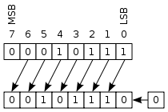
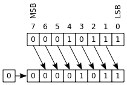
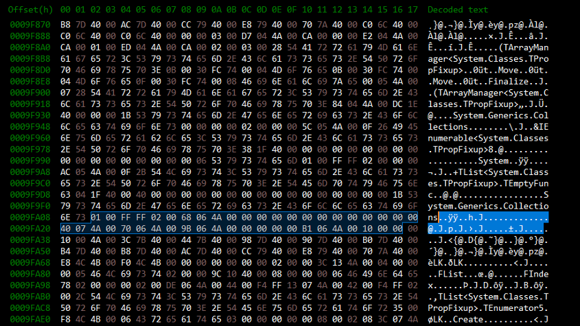
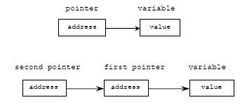
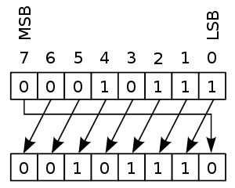

# Laborator 01: Reprezentarea numerelor, operații pe biți și lucru cu memoria

Pentru reprezentarea informațiilor (instrucțiuni și date), calculatoarele folosesc sistemul binar (baza 2). În cazul scrierii programelor în limbaj de asamblare este preferat sistemul hexazecimal (baza 16), pentru că scutește programatorul de scrierea șirurilor lungi de 1 și 0, iar conversia din/în binar se poate face mult mai ușor decât în cazul sistemului zecimal (baza 10).

## Sistemele binar și hexazecimal

Înainte de a începe lucrul cu limbajul de asamblare, este necesar să ne familiarizăm cu sistemele binar și hexazecimal și cu modalitățile de conversie între ele.

>**NOTE**: Pentru reprezentarea numerelor în binar vom folosi prefixul 0b, iar pentru cele în hexazecimal vom folosi 0x.

### Sistemul binar

În **sistemul binar** (baza 2), valorile sunt reprezentate ca un șir de 0 și 1. Fiecare cifră din șir reprezintă un bit, iar un grup de 8 biți formează un octet (byte). Un grup de 4 biți poartă denumirea de **nibble**, sau **half-byte**.

#### Operații cu valori reprezentate în binar

##### Operații aritmetice

[Ghid pentru operații aritmetice.](https://www.tutorialspoint.com/computer_logical_organization/binary_arithmetic.htm)

#### Operații logice

##### Operatori pe valori binare

1. **Inversare (NOT)**: se inversează fiecare bit. Exemplu: INV(0b10011010) = 0b01100101
2. **Și logic (AND)**: se efectuează operația 'și' între biții de pe aceleași poziții din operanzi. Exemplu: 0b1001 AND 0b0111 = 0b0001
3. **Sau logic (OR)**: se efectuează operația 'sau' între biții de pe aceleași poziții din operanzi. Exemplu: 0b1001 OR 0b0111 = 0b1111
4. **Sau exclusiv (XOR)**: dacă biții de pe aceleași poziții din operanzi au valori egale, bitul rezultat are valoarea 0, altfel are valoarea 1. Exemplu: 0b1001 XOR 0b0111 = 0b1110

##### Deplasări (Shifts)

###### Deplasări logice

Deplasările logice dreapta/stânga presupun mutarea cu o poziție a fiecărui bit. Cum rezultatul trebuie să fie pe același număr de biți ca valoarea inițială, primul bit este pierdut, iar spațiul gol este completat cu bitul 0.





Pentru explicații legate de operațiile pe biți în C urmăriți ghidul de la adresa [Operații pe biți în C](https://www.geeksforgeeks.org/bitwise-operators-in-c-cpp/).

### Sistemul hexazecimal

În **sistemul hexazecimal** (baza 16), valorile sunt reprezentate sub forma unui șir de caractere din intervalul '0'-'9' sau 'a'-'f'. Un octet este format din două astfel de caractere, deci fiecare caracter corespunde unui grup de 4 biți (un nibble).

#### Conversia din zecimal în binar/hexazecimal

- Se împarte succesiv numărul la numărul bazei (2 sau 16) și se rețin resturile
- Când câtul împărțirii devine 0, se scriu resturile în ordine inversă.
- În cazul bazei 16, atunci când restul este mai mare decât 9 se folosesc literele a-f (10=a, 15=f)

##### Exemplu: conversia numărului 0xD9B1 în zecimal

0xD9B1 = 1 * 16 ^ 0 + 11 * 16 ^ 1 + 9 * 16 ^ 2 + 13 * 16 ^ 3 = 55729

#### Conversia intre binar și hexazecimal

După cum am precizat anterior, o cifră din cadrul unui număr în hexazecimal corespunde unui grup de 4 biți (un nibble). Astfel, pentru a converti un număr din hexazecimal în binar este suficient să transformăm fiecare cifră în grupul de 4 biți echivalent.

##### Exemplu: Conversia numărului 0xD9B1 în binar

- 0x1 = 0b0001
- 0xB = 0b1011
- 0x9 = 0b1001
- 0xD = 0b1101

Astfel, numărul obținut în binar este **0b1101100110110001**.

Operația inversă, conversia din binar în hexazecimal se poate face convertind fiecare grup de 4 biți în cifra corespunzătoare în hexazecimal.

#### La ce utilizăm reprezentarea în baza 16?

Sistemul hexazecimal este utilizat pentru a reprezenta adresele la care se află datele în memorie și pentru a vizualiza aceste date într-un mod mai ușor de interpretat decât o secvență compusă doar din 0 și 1. Imaginea de mai jos oferă un exemplu în acest sens:



(Imagine preluata de pe [Digital Detective](https://www.digital-detective.net/))

### Reprezentarea tipurilor de date

În memoria unui calculator o valoare este memorată pe un număr fix de biți. În funcție de arhitectură fiecare procesor poate accesa un număr maxim de biți în cadrul unei operații, acest număr de biți reprezintă dimensiunea cuvântului (**word size**).

Dimensiunile tipurilor de date uzuale folosite în C sunt dependente atât de procesor, cât și de platforma cu ajutorul căreia a fost compilat programul (sistem de operare, compilator). În tabelul de mai jos sunt prezentate dimensiunile tipurilor de date pe un procesor cu dimensiunea cuvântului arhitecturii de 32 de biți, în cazul în care programul este compilat folosind gcc, sub Linux.

În partea stângă avem adresele din memorie unde se află date. La adresa **0x0009FA08** primii 4 octeți începând cu offset-ul **0x02** sunt **0x01**, **0x00**, **0xFF**, **0xFF**. Aceștia pot reprezenta un întreg pe 4 octeți, 4 caractere, 2 întregi pe 2 octeți. Folosind baza 16 putem să interpretăm datele reușind astfel să intuim ce ar putea să reprezinte acestea.

| Tip de date |	Număr biți |	Număr octeți |
|-------------|------------|-----------------|
| char        |   	8  |	1            |
| short       |  	16 |	2            |
| int         |   	32 |	4            |
| long        |   	32 |	4            |
| long long   |   	64 |	8            |
| pointer     |  	32 |	4            |

### Ordinea de reprezentare a numerelor mai mari de un octet (Little-Endian vs Big-Endian)

 Pentru reprezentarea valorilor mai mari de un octet există două metode posibile, ambele folosite în practică:

- Little-Endian: cel mai puțin semnificativ octet este memorat primul(octeții sunt memorați în ordine inversă). Acest model este folosit de familia de procesoare Intel x86.
- Big-Endian: cel mai semnificativ octet este memorat primul.

**Exemplu**: Dorim să stocăm valoarea 0x4a912480 în memorie pe 32 de biți (4 octeți), începând cu adresa 0x100, folosind cele două metode:

| Metoda        | Adresa 0x100 | Adresa 0x101 | Adresa 0x102 | Adresa 0x103 |
|---------------|--------------|--------------|--------------|--------------|
| Little-Endian |	0x80   |     0x24     |	   0x91      |	  0x4a      |
| Big-Endian 	|       0x4a   |     0x91     |    0x24      | 	  0x80      |

## Pointeri în C

În limbajul C un pointer este o variabilă a cărei valoare este adresa unei alte variabile. Ne putem gândi la un pointer ca un intermediar, și anume o variabilă care indică către o locație finală sau către un alt intermediar după cum se poate vedea în imaginea și codul de mai jos.



(Imagine preluata de pe [Tenouk](https://www.tenouk.com/))

```cpp
#include <stdio.h>
 
int main()
{
    int v;
    int *p;  /* pointer la un întreg pe 32 biți */
    int **pp;  /* pointer la un pointer care conține conține adresa unui întreg pe 32 biți */
 
    /* Pentru a accesa adresa unei variabile în C se folosește operatorul &(referențiere) */
    p = &v;  /* p conține adresa valorii v */
    pp = &p;  /* pp conține adresa adresei valorii v */
 
    v = 69;
    /* Pentru a accesa valoarea de la adresa memorată de un pointer se folosește operatorul *(dereferențiere) */
    printf("v(%d) - *p(%d) - **pp(%d)\n", v, *p, *(*pp));  /* se va afișa v(69) - *p(69) - **pp(69) */
 
    return 0;
}
```

### Avantaje pointeri

- pointerii sunt folosiți la crearea de structuri de date complexe precum liste înlănțuite, arbori, grafuri, tabele de dispersie, etc.
- pointerii se folosesc pentru a transfera informații între funcții diferite sau apeluri recursive fără a folosi variabile globale
- folosind pointeri putem să (re)alocăm memorie dinamic
- putem să avem ca parametri pentru funcții alte funcții, șiruri de caractere, structuri de date complexe

### Dezavantaje pointeri

- un pointer care nu este inițializat, dar este folosit într-un program duce la **segmentation fault** prin accesarea unei zone de memorie restricționate
- eliberarea memoriei alocate dinamic se face manual de către programator
- pentru a accesa o valoare este nevoie de dereferențiere, operație care este mai lentă decât accesarea directă a valorii

În C se poate defini un pointer către oricare dintre tipurile de date care există în limbaj cât și pentru **void**. Un void pointer diferă de un pointer către un tip de date explicit prin faptul că un void pointer **NU** poate fi folosit în operații cu pointeri, void neavând o dimensiune clară. Un exemplu de bază unde se folosesc pointerii și operațiile cu pointeri este alocarea și parcurgerea unui tablou de valori:

```cpp
#include <stdio.h>
#include <stdlib.h>
 
#define ARR_LENGTH 5
 
int main()
{
   int *arr, i;
 
   arr = (int *)malloc(sizeof(int) * ARR_LENGTH);
   // arr = (int *)calloc(ARR_LENGTH, sizeof(int));
 
   for (i = 0; i < ARR_LENGTH; ++i) {
       /*
        * arr + i iterează prin adresele fiecărui element din tablou însă adresa arr + i nu crește cu i ci cu i * sizeof(int), arr fiind un pointer la int
        * în C nu se vede și nu este necesară această operație dar mai târziu în limbajul de asamblare va fi necesar 
        */
       printf("arr[%d] = %d: ", i, *(arr + i));
   }
 
   free(arr);
   return 0;
}
```

Pointerii oferă o flexibilitate mare în ce privește accesul la memorie. Mai jos este un exemplu în acest sens care verifică dacă un sistem este little sau big endian, folosind cast între diverse tipuri de pointeri.

```cpp
#include <stdio.h>
 
int main()
{
    int v = 0x00000001;
    unsigned char *first_byte = (unsigned char *)&v;
 
    if (*first_byte == 0x01)
        printf("little-endian\n");
    else
        printf("big-endian\n");
 
    return 0;
}
```

## Exerciții

>**NOTE**: În cadrul laboratoarelor vom folosi repository-ul de git al materiei IOCLA - (https://github.com/systems-cs-pub-ro/iocla). Repository-ul este clonat pe desktop-ul mașinii virtuale. Pentru a-l actualiza, folosiți comanda `git pull origin master` din interiorul directorului în care se află repository-ul (~/Desktop/iocla).Recomandarea este să îl actualizați cât mai frecvent, înainte să începeți lucrul, pentru a vă asigura că aveți versiunea cea mai recentă. Dacă doriți să descărcați repository-ul în altă locație, folosiți comanda `git clone https://github.com/systems-cs-pub-ro/iocla ${target}`. Pentru mai multe informații despre folosirea utilitarului `git`, urmați ghidul de la [Git Immersion](https://gitimmersion.com).

### 1. Conversii

Efectuați următoarele conversii între sisteme de numerație:

a. Din decimal în binar și hexazecimal:

- 121
- 18446

b. Convertiți în zecimal:

- 0b1100010111010010
- 0xBB29

c. Din hexazecimal în binar:

- 0x5E
- 0x4A01

d. Din binar în hexazecimal:

- 0b01111101
- 0b1000110000011111

>**TIP**: În rezolvarea exercițiilor următoare NU aveți voie să modificați semnătura funcțiilor pe care trebuie să le implementați. Veți porni de la un fișier inițial și puteți adăuga oricâte funcții și fișiere auxiliare considerați, dar aveți în vedere că dacă adăugați fișiere noi va trebui să modificați Makefile-ul, să creați un nou Makefile sau să compilați manual. Recomandarea este să utilizați fișierul pus deja la dispoziția voastră fără a adăuga altele noi.
>Pentru compilare și execuție puteți folosi:
>    make build
>    make run
>    make clean(opțional, pentru a șterge fișierele obiect și executabilul)

### 2. Lungime și egalitate cu operații pe biți

Veți rezolva exercițiul plecând de la fișierul **len_xor.c** aflat în directorul **2-len_xor**.

Pentru un șir de caractere dat, să se afișeze:

- lungimea șirului de caractere
- adresa fiecărui caracter de pe poziția i care este egal cu caracterul de poziția i + 2^i (dacă i + 2^i depășește dimensiunea șirului de caractere se va folosi operația modulo)

Folosiți cât de mult posibil operații cu pointeri și operații pe biți!

>**NOTE**: Nu folosiți în rezolvare funcții precum strlen, sizeof, pow, si nu verificați egalitatea folosind ==. De asemenea, nu accesați elementele șirului sub forma s[i].

>**TIP**: Pentru șirul de caractere “aac”:
>
>    length = 3
>    Address of a: 0x564c364482a0
>    Address of a: 0x564c364482a1
>
>Pentru șirul de caractere “ababababacccbacbacbacbacbabc”:
>
>    length = 28
>    Address of b: 0x563f0da6f2a1
>    Address of a: 0x563f0da6f2a2
>    Address of c: 0x563f0da6f2a9
>   Address of a: 0x563f0da6f2b0
>    Address of b: 0x563f0da6f2b2
>    Address of b: 0x563f0da6f2b5
>    Address of c: 0x563f0da6f2b7
>    Address of a: 0x563f0da6f2b9
>
>**Adresele de mai sus sunt orientative!**

### 3. Oglindirea unui șir de caractere

Veți rezolva exercițiul plecând de la fișierul **mirror.c** aflat în directorul **3-mirror**.

Folosind operații cu pointeri implementați un program în C care inversează un șir de caractere. Funcția `mirror` trebuie să realizeze rotirea datelor din șirul de caractere **in-place** (la ieșirea din funcție, șirul dat ca intrare va conține șirul inversat).

>**NOTE**: Nu accesați elementele șirului sub forma s[i]. 

>**TIP**: 
>    mirror(“AnaAreMere”) = “ereMerAanA”
>
>    mirror(“asdfghjl”) = “ljhgfdsa”
>
>    mirror(“qwerty”) = “ytrewq”

### 4. Rotații

Veți rezolva exercițiul plecând de la fișierul rotations.c aflat în directorul 4-rotations.

Implementați în C rotație stânga și rotație dreapta pentru numere întregi pe 32 de biți. 

>**TIP**: Operația de rotire (numită și deplasare circulară) este similară cu cea de deplasare, singura diferență fiind aceea că spațiul gol generat de deplasare este înlocuit cu bitul eliminat.
>
> Exemplu rotație **stânga** cu **un** bit:
>
>

>**NOTE**: 
>    rotate_left(0x80000000, 1) = 1
>    rotate_right(0x00000001, 16) = 65536

### 5. Par binar și impar hexa

Veți rezolva exercițiul plecând de la fișierul odd_even.c aflat în directorul 5-odd_even.

Să se parcurgă un tablou de întregi pe 32 de biți folosind operații cu pointeri și să se afișeze în binar numerele pare și în hexazecimal numerele impare.

>**NOTE**: În rezolvare folosiți operații pe biți oriunde este posibil! 

>**NOTE**: Pentru vectorul: 214, 71, 84, 134, 86, programul va afișa:
>
>    0b11010110
>    0x00000047
>    0b01010100
>    0b10000110
>    0b01010110

## Soluții

Soluțiile pentru exerciții sunt disponibile [aici](https://elf.cs.pub.ro/asm/res/laboratoare/lab-01-sol.zip).


