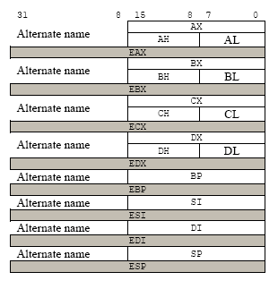
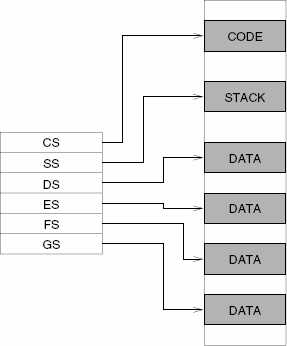
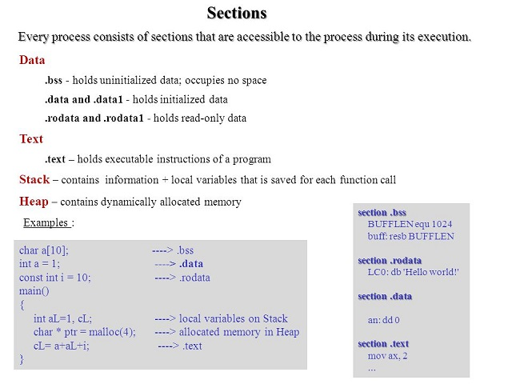

# Laborator 06: Rolul registrelor, adresare directă și bazată

În acest laborator vom aprofunda lucrul cu registre și modul în care se utilizează memoria atunci când programăm assembly pe un sistem x86 de 32 biți.

## Registre

Registrele sunt principalele “unelte” cu care se scriu programele în limbaj de asamblare. Acestea sunt precum variabile construite în procesor. Utilizarea registrelor în locul adresării directe a memoriei face ca dezvoltarea și citirea programelor scrise în assembly să fie mai rapidă și mai ușoara. Singurul dezavantaj al programării în limbaj de asamblare x86 este acela că sunt puține registre.

Procesoarele x86 moderne dispun de 8 registre cu scop general a căror dimensiune este de 32 de biți. Numele registrelor sunt de natură istorică (spre exemplu: EAX era numit registru acumulator din cauza faptului că este folosit de o serie de instrucțiuni aritmetice, cum ar fi [idiv](https://www.felixcloutier.com/x86/idiv)). In timp ce majoritatea registrelor și-au pierdut scopul special, devenind “general purpose” în ISA-ul modern(EAX, EBX, ECX, EDX, ESI, EDI), prin convenție, 2 și-au pastrat scopul inițial: ESP (stack pointer) și EBP (base pointer).

### Subsecțiuni ale registrelor

În anumite cazuri dorim să modificăm valori ce sunt reprezentate pe mai puțin de 4 octeți (spre exemplu, lucrul cu șiruri de caractere). Pentru aceste situații, procesoarele x86 ne oferă posibilitatea de a lucra cu subsectiuni de 1, respectiv 2 octeți ale registrelor EAX, EBX, ECX, EDX.

În imaginea de mai jos sunt reprezentate registrele, subregistrele și dimensiunile lor.



> **WARNING**: Subregistrele fac parte din registre, ceea ce înseamnă că dacă modificăm un registru, în mod implicit modificăm și valoarea subregistrului.

> **NOTE**: Subregistrele se folosesc în mod identic cu registrele, doar că dimensiunea valorii reținute este diferită.

> **NOTE**: Pe lângă registrele de bază mai există și șase registre segment corespunzătoare unor anumite zone după cum se observă în imagine:
>
> 

### Declarări statice de regiuni de memorie

Declarările statice de memorie (analoage declarării variabilelor globale), în lumea x86, se fac prin intermediul unor directive de asamblare speciale. Aceste declarări se fac în secțiunea de date (regiunea .DATA). Porțiunilor de memorie declarate le pot fi atașate un nume prin intermediul unui label pentru a putea fi referite ușor mai târziu în program. Urmăriți exemplul de mai jos:

```Assembly
.DATA
    var        DB 64    ; Declară un octet conținând valoarea 64. Etichetează
                        ; locația de memorie cu "var".
    var2       DB ?     ; Declară un octet neinițializat etichetat cu "var2".
               DB 10    ; Declară un octet neetichetat, inițializat cu 10. Acest
                        ; octet va fi plasat la adresa (var2 + 1).
    X          DW ?     ; Declară un cuvânt(2 octeți) neinițializat, etichetat cu "X".
    Y          DD 3000  ; Declară un cuvânt dublu (4 octeți) cu eticheta "Y",
                        ; inițializat cu valoarea 3000.
    Z          DD 1,2,3 ; Declară 3 cuvinte duble (a câte 4 octeți fiecare)
                        ; incepând cu adresa "Z" și inițializate cu 1, 2, respectiv 3.
                        ; De exemplu, 3 va fi plasat la adresa (Z + 8).
```

> **NOTE**: DB, DW, DD sunt directive folosite pentru a specifica dimensiunea porțiunii:
> | Directivă | Rol | Dimensiune |
> | ----------|-----|----------- |
> | DB | Define Byte | 1 octet (8 biți) |
> | DW | Define Word | 2 octeți (16 biți) |
> | DD | Define Double Word | 4 octeți (32 biți) |

> **NOTE**: Sunt mai multe tipuri de regiuni de memorie după cum se poate observa și în imaginea de mai jos:
>
> 

Ultima declarare din exemplul de mai sus reprezintă declararea unui vector. Spre deosebire de limbajele de nivel mai înalt, unde vectorii pot avea multiple dimensiuni, iar elementele lor sunt accesate prin indici, în limbajul de asamblare vectorii sunt reprezentați ca un număr de celule ce se află intr-o zonă contiguă de memorie.

## Adresarea Memoriei

Procesoarele x86 moderne pot adresa pana la 2^32 bytes de memorie, ceea ce înseamnă că adresele de memorie sunt reprezentate pe 32 de biți. Pentru a adresa memoria, procesorul folosește adrese (implicit, fiecare label este translatat într-o adresa de memorie corespunzătoare). Pe lângă label-uri mai există și alte forme de a adresa memoria:

```Assembly
mov eax, [0xcafebab3]         ; directă (deplasament)
mov eax, [esi]                ; indirectă (bază)
mov eax, [ebp-8]              ; bazată (bază + deplasament)
mov eax, [ebx*4 + 0xdeadbeef] ; indexată (index * scală + deplasament)
mov eax, [edx + ebx + 12]     ; bazată și indexată fără scală (bază + index + deplasament)
mov eax, [edx + ebx*4 + 42]   ; bazată și indexată cu scală (bază + index * scală + deplasament)
```

> **WARNING**: Următoarele adresări sunt invalide:
>
> ```Assembly
> mov eax, [ebx-ecx]     ; Registrele pot fi doar adunate
> mov [eax+esi+edi], ebx ; Calculul adresei poate conține cel mult 2 registre
> ```

### Directive de dimensiune

În general, dimensiunea pe care este reprezentată o valoare ce este adusă din memorie poate fi inferată (dedusă) din codul instrucțiunii folosite. Spre exemplu, în cazul adresărilor de mai sus, dimensiunea valorilor putea fi inferată din dimensiunea registrului destinație, însă în anumite cazuri acest lucru nu este atât de evident. Să urmarim urmatoarea instrucțiune:

```Assembly
mov [ebx], 2
```

Dupa cum se observă, se dorește stocarea valorii 2 la adresa conținută de registrul ebx. Dimensiunea registrului este de 4 bytes. Valoarea 2 poate fi reprezentată atât pe 1 cât și pe 4 bytes. În acest caz, din moment ce ambele interpretări sunt valide, procesorul are nevoie de informații suplimentare despre cum să trateze această valoare. Acest lucru se poate face prin directivele de dimensiune:

```Assembly
mov byte [ebx], 2  ; Mută valoarea 2 în octetul de la adresa conținută în EBX.
mov word [ebx], 2  ; Mută întregul 2 reprezentat pe 16 biți în cei 2 octeți
                   ; începând de la adresa conținută în EBX
mov dword [ebx], 2 ; Mută întregul 2 reprezentat pe 32 de biți în cei 4 octeți
                   ; începând de la adresa conținută în EBX
```

### Instrucțiunea loop

Instrucțiunea loop se folosește pentru bucle cu un număr de iterații prestabilit, încărcat în registrul ECX. Sintaxa ei este urmatoarea:

```Assembly
mov ecx, 10 ; Inițializează ECX cu numărul de iterații
label:
; conținutul buclei
loop label
```

La fiecare iterație, se decrementează registrul ECX și se verifică dacă este diferit de 0. În acest caz, se sare la eticheta precizată. Există și alte forme ale instrucțiunii care verifică, în plus, flagul ZF:

| Mnemonică | Descriere |
| ----------|---------- |
| LOOPE/LOOPZ label | Decrementează ECX; sari la eticheta label dacă ECX != 0 și ZF == 1 |
| LOOPNE/LOOPNZ label | Decrementează ECX; sari la eticheta label dacă ECX != 0 și ZF != 1 |

> **NOTE**: Ceea ce trebuie să aveți în vedere atunci când utilizați salturi într-un program scris în limbaj de asamblare este diferența dintre short jump(near jump) și long jump(far jump).
> | Tip și exemplu | Dimensiune și semnificație | Descriere |
> | ---------------|----------------------------|---------- |
> | Short Jump (loop) | 2 octeți (un octet pentru opcode(Operation Code) și un octet pentru adresă) | adresa relativă a instrucțiunii către care se dorește să se facă jump-ul trebuie să nu fie la distanță mai mare de 128 octeți față de adresa instrucțiunii curente |
> | Long Jump (jmp) | 3 octeți (un octet pentru opcode(Operation Code) și doi octeți pentru adresă) | adresa relativă a instrucțiunii către care se dorește să se facă jump-ul trebuie să nu fie la distanță mai mare de 32768 octeți față de adresa instrucțiunii curente |

## Tutoriale și exerciții

> **NOTE**: În cadrul laboratoarelor vom folosi repository-ul de git al materiei IOCLA - <https://github.com/systems-cs-pub-ro/iocla>. Repository-ul este clonat pe desktop-ul mașinii virtuale. Pentru a îl actualiza, folosiți comanda git pull origin master din interiorul directorului în care se află repository-ul (~/Desktop/iocla). Recomandarea este să îl actualizați cât mai frecvent, înainte să începeți lucrul, pentru a vă asigura că aveți versiunea cea mai recentă.Dacă doriți să descărcați repository-ul în altă locație, folosiți comanda git clone <https://github.com/systems-cs-pub-ro/iocla> ${target}.Pentru mai multe informații despre folosirea utilitarului git, urmați ghidul de la [Git Immersion](https://gitimmersion.com/).

### 0. Recapitulare: Descompunerea unui număr în puteri ale lui 2

Pornind de la fișierul sursă `power-2.asm`, realizați un program care descompune un număr în puteri ale lui 2. Numărul va fi pasat prin registrul `eax`.

De exemplu, pentru `eax = 211`, programul vostru va afișa:

```
1
2
16
64
128
```

> **TIP**: Încercați să vă aduceți aminte ce face instrucțiunea test.

### 1. Tutorial: Înmulțirea a două numere reprezentate pe un octet

Parcurgeți, rulați și testați codul din fișierul `multiply.asm`. În cadrul programului înmulțim două numere definite ca octeți. Pentru a le putea accesa folosim o construcție de tipul `byte [register]`.

Atunci cănd facem înmulțire procesul este următorul, așa cum este descris și [aici](https://en.wikibooks.org/wiki/X86_Assembly/Arithmetic):

1. Plasăm deînmulțitul în registrul de deînmulțit, adică:
    * dacă facem operații pe un byte (8 biți, un octet), plasăm deînmulțitul în registrul `AL`;
    * dacă facem operații pe un cuvânt (16 biți, 2 octeți, plasăm deînmulțitul în registrul `AX`;
    * dacă facem operații pe un dublu cuvânt (32 de biți, 4 octeți), plasăm deînmulțitul în registrul `EAX`.
1. Înmulțitorul este transmis ca argument mnemonicii `mul`. Înmulțitorul trebuie să aibă aceeași dimensiune ca deînmulțitul.
1. Rezultatul este plasat în două registre (partea high și partea low).

Testați programul. Încercați alte valori pentru num1 și num2.

### 2. Înmulțirea a două numere

Actualizați zona marcată cu `TODO` în fișierul `multiply.asm` pentru a permite înmulțirea și a numelor de tip `word` și `dword`, adică `num1_dw` cu `num2_dw`, respectiv `num1_dd` și `num2_dd`.

> **TIP**: Pentru înmulțirea numerelor de tip word (pe 16 biți), componentele sunt dispuse astfel:
>
> * În registrul `AX` se plasează deînmulțitul.
> * Argumentul instrucțiunii, înmulțitorul, `mul` (posibil un alt registru) este pe 16 biți (fie valoare fie un registru precum `BX`, `CX`, `DX`).
> * Rezultatul înmulțirii este dispus în perechea `DX:AX`, adică partea “high” a `rezultatului în registrul DX, iar partea “low” a rezultatului în registrul AX`.
>
> Pentru înmulțirea numerelor de tip `dword` (pe 32 biți), componentele sunt dispuse astfel:
>
> * În registrul `EAX` se plasează deînmulțitul.
> * Argumentul instrucțiunii, înmulțitorul, mul (posibil un alt registru) este pe 32 biți (fie valoare fie un registru precum `EBX`, `ECX`, `EDX`).
> * Rezultatul înmulțirii este dispus în perechea `EDX:EAX`, adică partea “high” a rezultatului în registrul `EDX`, iar partea “low” a rezultatului în registrul `EAX`.

> **NOTE**: La afișarea rezultatului folosiți macro-ul `PRINTF32` pentru a afișa cele două registre care conțin rezultatul:
>
> * Registrele `DX` și `AX` pentru înmulțirea numerelor de tip word.
> * Registrele `EDX` și `EAX` pentru înmulțirea numerelor de tip dword.

### 3. Tutorial: Suma primelor N numere naturale

În programul `sum_n.asm` este calculată suma primelor num numere naturale.

Urmăriți codul, observați construcțiile și registrele specifice pentru lucru cu bytes. Rulați codul.

> **IMPORTANT**: Treceți la următorul pas doar după ce ați înțeles foarte bine ce face codul. Vă va fi greu să faceți următorul exercițiu dacă aveți dificultăți în înțelegerea exercițiului curent.

### 4. Suma pătratelor primelor N numere naturale

Porniți de la programul `sum_n.asm` și creați un program `sum_n_square.asm` care să calculeze suma pătratelor primelor num numere naturale (num < = 100).

> **TIP**: Registrele `eax` și `edx` le veți folosi la înmulțirea pentru ridicarea la putere (în instrucțiunea `mul`). Astfel că nu veți mai putea folosi (ușor) registrul `eax` pentru stocarea sumei pătratelor. Pentru a reține suma pătratelor aveți două variante:
>
> 1. (mai simplu) Folosiți registrul `ebx` pentru a reține suma pătratelor.
> 2. (mai complicat) Înainte de a opera registrul `eax` salvați valoarea sa pe stivă (folosind instrucțiunea `push`), apoi faceți operațiile necesare și apoi restaurați valoarea salvată (folosind instrucțiunea `pop`).

> **NOTE**: Pentru verificare, suma pătratelor primelor 100 de numere naturale este `338350`.

### 5. Tutorial: Suma elementelor dintr-un vector reprezentate pe un octet

În programul `sum_array.asm` este calculată suma elementelor unui vector (array) de octeți (bytes, reprezentare pe 8 biți).

Urmăriți codul, observați construcțiile și registrele specifice pentru lucru cu bytes. Rulați codul.

> **IMPORTANT**: Treceți la următorul pas doar după ce ați înțeles foarte bine ce face codul. Vă va fi greu să faceți exercițiile următoare dacă aveți dificultăți în înțelegerea exercițiului curent.

### 6. Suma elementelor dintr-un vector

În zona marcată cu TODO din fișierul `sum_array.asm` completați codul pentru a realiza suma vectorilor cu elemente de tip word (16 biți) și de tip dword (32 de biți); este vorba de vectorii `word_array` și `dword_array`.

> **TIP**: Când veți calcula adresa unui element din array, veți folosi construcție de forma:
>
> ```base + size * index```
>
> În construcția de mai sus:
>
> * base este adresa vectorului (adică word_array sau `dword_array`)
> * size este lungimea elementului vectorului (adică 2 pentru vector de word (16 biți, 2 octeți) și 4 pentru vector de dword (32 de biți, 4 octeți)
> * index este indexul curent în cadrul vectorului

> **NOTE**: Suma elementelor celor trei vectori trebuie să fie:
>
> * `sum(byte_array): 575`
> * `sum(word_array): 65799`
> * `sum(dword_array): 74758117`

### 7. Suma pătratelor elementelor dintr-un vector

Pornind de la programul de la exercițiul anterior, calculați suma pătratelor elementelor dintr-un vector.

> **NOTE**: Puteți folosi vectorul `dword_array`, având însă grijă ca suma pătratelor elementelor conținute să poată fi reprezentată pe 32 de biți.

> **NOTE**: Dacă folosiți construcția de mai jos (vector cu 10 elemente)
>
> ```
> dword_array dd 1392, 12544, 7992, 6992, 7202, 27187, 28789, 17897, 12988, 17992
>```
>
> suma pătratelor va fi 2704560839.

### 8. Împărțirea a două numere

În programul `divide.asm` sunt calculate câtul și restul a două numere reprezentate pe un octet. Actualizați zona marcată cu `TODO` pentru a realiza împărțirile `dividend2 / divisor2` (împărțitor de tip word) și `dividend3 / divisor3` (împărțitor de tip dword).

În mod similar instrucțiunii `mul`, regiștrii în care este plasat deîmpărțitul variază în funcție de dimensiunea de reprezentare a împărțitorului. Împărțitorul este transmis ca argument mnemonicii `div`.

> **TIP**: Dacă împărțitorul este de tip `byte` (8 biți), componentele sunt dispuse astfel:
>
> * deîmpărțitul este plasat în registrul `AX`
> * argumentul instrucțiunii `div` are 8 biți și poate fi reprezentat de un registru sau de o valoare imediată
> * câtul este dispus în `AL`
> * restul este dispus în `AH`
>
> Dacă împărțitorul este de tip `word` (16 biți), componentele sunt dispuse astfel:
>
> * deîmpărțitul este dispus în perechea `DX:AX`, adică partea sa `high` în registrul `DX`, iar partea `low` în `AX`
> * argumentul instrucțiunii `div` are 16 biți și poate fi reprezentat de un registru sau de o valoare imediată
> * câtul este dispus în `AX`
> * restul este dispus în `DX`
>
> Dacă împărțitorul este de tip `dword` (32 de biți), componentele sunt dispuse astfel:
>
> * deîmpărțitul este dispus în perechea `EDX:EAX`, adică partea sa `high` în registrul `EDX`, iar partea `low` în `EAX`
> * argumentul instrucțiunii `div` are 32 de biți și poate fi reprezentat de un registru sau de o valoare imediată
> * câtul este dispus în `EAX`
> * restul este dispus în `EDX`

> **TIP**: Dacă programul vă dă “SIGFPE. Arithmetic exception”, cel mai probabil aţi uitat să iniţializaţi partea superioară a deîmpărţitului (AH, DX sau EDX).

### 9. Bonus: Numărul de numere negative și pozitive dintr-un vector

Creați un program care afișează numărul de numere negative, respectiv numărul de numere pozitive dintr-un vector.

> **NOTE**: Definiți un vector care să conțină atât numere negative cât și numare pozitive.

> **TIP**: Folosiți intrucțiunea `cmp` și mnemonici de salt condițional. Urmăriți detalii aici.

> **TIP**: Intrucțiunea `inc` urmată de un registru incrementează cu 1 valoarea stocată în acel registru.

### 10. Bonus: Numărul de numere pare și impare dintr-un vector

Creați un program care afișează numărul de numere pare, respectiv numărul de numere impare dintr-un vector.

> **TIP**: Puteți folosi instrucțiunea `div` pentru a împărți un număr la 2 și pentru a compara apoi restul împărțirii cu 0.

> **NOTE**: Pentru testare folosiți un vector doar cu numere pozitive. Pentru numere negative trebuie să faceți extensie de semn; ar merge și fără pentru că ne interesează doar restul, dar nu am fi riguroși :-)

### Links

* [X86 Instruction reference](https://www.felixcloutier.com/x86/index.html)
* [Alte cursuri de assembler](https://www.cs.virginia.edu/~evans/cs216/guides/x86.html)

## Soluții

Soluțiile pentru exerciții sunt disponibile [aici](https://elf.cs.pub.ro/asm/res/laboratoare/lab-06-sol.zip).
