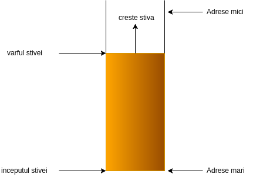
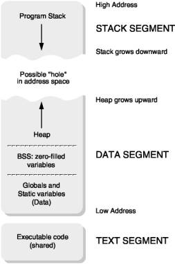

# Laborator 08: Lucrul cu stiva

În acest laborator vom învăța cum este reprezentată stiva in limbajul de asamblare, care este utilitatea ei si cum se programeaza cu ajutorul acesteia.

## Terminologie

In lumea algoritmicii, stiva este o structura de date abstracta prin intermediul careia se poate reprezenta informatie ce respecta regula “primul venit, ultimul servit”.

In lumea programarii assembly, stiva este o zona rezervata de memorie folosita pentru a tine evidenta operatiilor interne ale unui program: functii, adrese de retur, parametrii pasati, etc. Astfel, stiva poate fi vazuta ca o implementare la nivel hardware a stivei abstracte.

## Utilitatea stivei

* **Apeluri de functii.** Fiecare apel de functie necesita, printre altele, memorarea adresei de retur. Imaginati-va ca aveti un numar de functii N ce se apeleaza succesiv : prima functie o apeleaza pe a 2-a, a 2-a pe a 3-a si asa mai departe; cand functia N a fost apelata si si-a terminat executia, programul trebuie sa continue in contextul in care a avut loc apelul. Daca retinem adresele de retur intr-o stiva, ordinea apelurilor se pastreaza in mod natural.

* **Salvarea registrelor**. De asemenea, de fiecare data cand se apeleaza o functie, exista riscul ca registrele sa fie folosite de functia apelata. Prin urmare, valorile acestora se pierd si flow-ul programului se strica. Pentru a evita acest comportament, valorile registrelor se pot salva temporar, pana la sfarsitul apelului functiei, pe stiva. Acest lucru se poate face in doua moduri:

    1. Se salveaza independent fiecare registru ce poate fi suprascris in apel cu ajutorul instructiunii `push`. Problema apare din cauza ca apelantul nu poate cunoaste in prealabil ce registre se pot strica.

    1. Se salveaza toate registrele cu ajutorul instructiunii `pusha`. Aici dezavantajul apare cauzat de faptul ca operatia se face considerabil mai lent. In acelasi timp, vom vedea in laboratorul urmator ca functiile cu tip **returneaza** cu ajutorul registrului `eax` rezultatul. La folosirea instructiunii `popa`, responsabila pentru restaurarea registrelor, valoare lui `eax` va fi pierduta.

* **Variabile temporare.** In general, programele folosesc un numar mare de variabile si rezultate partiale; avand in vedere ca exista un numar limitat de registre, este posibil ca la un moment dat, sa nu avem niciun registru disponibil pentru a retine valoarea unei operatii. In cazul acesta, putem memora rezultatul la o adresa de memorie pe care o definim in zona de date. Aceasta metoda are dezavantajul ca vom “polua” tabela de offset-uri cu variabile pe care le folosim o singura data. In loc sa facem aceasta pentru fiecare rezultat partial, este mai usor sa punem pe stiva valoarea unui registru pentru a il putea folosi si a o recupera in momentul in care nu mai folosim variabila temporara.


## Operatii asupra stivei

Stiva poate fi modificata in 2 moduri:

1. Prin utilizarea instructiunilor special implementate pentru lucrul cu stiva, dintre care cele mai uzuale sunt `push` si `pop`:

```assembly
%include "io.asm"

section .text
global CMAIN
CMAIN:

    mov eax, 7
    mov ebx, 8
    add eax, ebx
    push eax                 ; pune pe stiva continutul registrului eax
    mov eax, 10              ; acum putem folosi registrul, intrucat valoarea lui este salvata pe stiva
    PRINTF32 `%d \n\x0`, eax ; 10

    pop eax                  ; recupereaza valoarea registrului eax
    PRINTF32 `%d \n\x0`, eax ; 15
```

1. Adresand memoria, cu ajutorului registrului in care este tinut pointerul catre capul stivei (“stack pointer”) `esp`:

```assembly
%include "io.asm"

section .text
global CMAIN
CMAIN:
    mov eax, 7
    mov ebx, 8
    add eax, ebx
    sub esp, 4           ; rezerva 4 octeti pe stiva
    mov [esp], eax       ; muta la noua adresa catre care pointeaza esp continutul registrului eax
    mov eax, 10
    PRINTF32 `%d \n\x0`, eax

    mov eax, [esp]       ; recupereaza valoarea de pe stiva
    add esp, 4           ; restabileste valoarea registrului esp
    PRINTF32 `%d \n\x0`, eax
```

> **IMPORTANT:** Comentati instructiunile `sub esp, 4` si `add esp, 4`. Ce se intampla? De ce?

> **NOTE:** Stiva este folosita pentru a memora adresa de retur in momentul in care o functie este apelata

**Remarcati faptul ca stiva creste de la adrese mari la adrese mici.** Acesta este motivul pentru care alocarea memoriei pe stiva se face folosind instructiunea sub, iar eliberarea se face folosind instructiunea add.




Unele procesoare nu au suport pentru lucrul cu stiva: spre exemplu, procesoarele [MIPS](https://en.wikipedia.org/wiki/MIPS_architecture) nu au instructiuni `push` si `pop` si nici un registru special pentru stack pointer. Astfel, daca am dori sa implementam operatiile pe stiva in procesorul MIPS aceasta s-ar realiza exact ca in exemplul de mai sus, doar ca am putea sa ne alegem noi orice registru pentru a tine minte stack pointerul.

Asadar, instructiunea `push eax`, pe un procesor x86, este echivalenta cu:

```assembly
sub esp, 4
mov [esp], eax
```

Iar instructiunea `pop eax`:

```assembly
mov eax, [esp]
add esp, 4
```

> **IMPORTANT:** Trebuie sa avem grija cu cantitatea de date alocate pe stiva intrucat dimensiunea acesteia este limitata. Umplerea stivei va duce la cunoscuta eroare de **stack overflow** (mai multe la laboratorul de securitate).

> **NOTE:** Stack size-ul default pe Linux pe o arhitectura pe 64 biti este de 8MiB.


## Stiva in contextul spatiului de adresa a unui proces

Spatiul de adresa al unui proces, sau, mai bine spus, spatiul virtual de adresa al unui proces reprezinta zona de memorie virtuala utilizabila de un proces. Fiecare proces are un spatiu de adresa propriu. Chiar in situatiile in care doua procese partajează o zona de memorie, spatiul virtual este distinct, dar se mapeaza peste aceeasi zona de memorie fizica.



In figura alaturata este prezentat un spatiu de adresa tipic pentru un proces.

Cele 4 zone importante din spatiul de adresa al unui proces sunt zona de date, zona de cod, stiva si heap-ul. După cum se observa si din figura, stiva si heap-ul sunt zonele care pot creste. De fapt, aceste doua zone sunt dinamice si au sens doar in contextul unui proces. De partea cealalta, informatiile din zona de date si din zona de cod sunt descrise in executabil.

## Tricks and tips

1. Regula de aur a utilizarii stivei este : numarul de `push`-uri == numarul de `pop`-uri intr-o functie. Avand in vedere ca stiva este folosita pentru apelarea functiilor, este foarte important ca in momentul in care o functie isi termina executia, sa actualizeze esp-ul astfel incat acesta sa indice catre aceeasi zona de memorie (a stivei) catre care indica in momentul intrarii in functie.

2. Avand in vedere ca exista situatii in care facem un numar N de `push`-uri si ajungem la finalul functiei fara sa fi facut `pop` pentru niciuna dintre valori, putem restabili capul stivei folosind instructiunea `add`.

```assembly
section .text
global CMAIN
CMAIN:
    mov eax, 5
    mov ebx, 6
    mov ecx, 7

    push eax
    push ebx
    push ecx

    add esp, 12     ; echivalent cu utilizarea a 3 pop-uri consecutive
    ret
```

3. Metoda de mai sus are dezavantajul ca tot trebuie sa cautam prin program cate `push`-uri am facut (ceea ce poate sa necesite destul de mult timp in programele din viata reala). Daca nu vrem sa nu ne batem deloc capul cu stack pointerul, putem sa folosim urmatoarea constructie:

```assembly
section .text
global CMAIN
CMAIN:

    mov ebp, esp       ; salveaza stack pointerul curent

    mov eax, 5
    mov ebx, 6
    mov ecx, 7

    push eax
    push ebx
    push ecx

    mov esp, ebp       ; restaureaza stack pointerul
    ret
```

> **IMPORTANT:** Care este intrebuintarea principala a registrului `ebp`?

Dupa cum putem observa, registrul ebp defineste stack frame-ul fiecarei functii. De altfel, la fel cum putem adresa variabilele locale cu ajutorul registrului esp, acelasi lucru este este posibil si cu ebp. Mai mult de atat, vom vedea ca parametrii functiei apelate sunt adresati cu ajutorul lui ebp.

## Exercitii
> **IMPORTANT:** În cadrul laboratoarelor vom folosi repository-ul de git al materiei IOCLA - https://github.com/systems-cs-pub-ro/iocla. Repository-ul este clonat pe desktop-ul mașinii virtuale. Pentru a îl actualiza, folosiți comanda `git pull origin master` din interiorul directorului în care se află repository-ul (`~/Desktop/iocla`). Recomandarea este să îl actualizați cât mai frecvent, înainte să începeți lucrul, pentru a vă asigura că aveți versiunea cea mai recentă.Dacă doriți să descărcați repository-ul în altă locație, folosiți comanda `git clone https://github.com/systems-cs-pub-ro/iocla ${target}`. Pentru mai multe informații despre folosirea utilitarului `git`, urmați ghidul de la [Git Immersion](https://gitimmersion.com/).
>
### 0. Recapitulare: Media aritmetică a elementelor dintr-un vector

Pornind de la exercițiul `0-recap-mean.asm` din arhiva de laborator, implementați codul lipsă, marcat de comentarii de tip `TODO`, pentru a realiza un program care calculează media aritmetică a elementelor dintr-un vector. Afișați doar partea întreagă a mediei (câtul împărțirii).

> **NOTE:** Dacă ați făcut calculul corect, suma elementelor vectorului va fi `3735` iar media aritmetică a elementelor din vector va fi `287`.


### 1. Max

Calculați maximul dintre numerele din 2 registre (`eax` și `ebx`) folosind o instrucțiune de comparație, o instrucțiune de salt și instrucțiuni `push`/`pop`.

> **TIP:** Gandiți-vă cum puteți să interschimbați două registre folosind stiva.


### 2. Construirea array-ului inversat

Pornind de la exercițiul `reverse-array.asm`, implementați `TODO`-urile **fără a folosi instrucțiunea `mov` în lucrul cu array-urile** astfel încât în array-ul `output` la finalul programului să se afle array-ul `input` inversat.

> **NOTE:** Dupa o rezolvare corecta programul ar trebui sa printeze:
>```
>    Reversed array:
>    911
>    845
>    263
>    242
>    199
>    184
>    122
>```

### 3. Adresarea si printarea stivei
Programul `stack-addressing.asm` din arhiva laboratorului alocă și inițializează două variabile locale pe stivă:

* un array format din numerele naturale de la 1 la `NUM`
* un string “Ana are mere”.

1. Înlocuiți fiecare instrucțiune `push` cu o secvență de instrucțiuni echivalentă.
1. Printați adresele și valorile de pe stivă din intervalul **[ESP, EBP]** (de la adrese mici la adrese mari) octet cu octet.
1. Printați string-ul alocat pe stivă octet cu octet și explicați cum arată acesta în memorie. Gândiți-vă de la ce adresă ar trebui să afișați și când ar trebui să vă opriți.
1. Printați vectorul alocat pe stivă element cu element. Gândiți-vă de la ce adresă ar trebui să începeți afișarea și ce dimensiune are un element.

> **NOTE:** După o implementare cu succes, programul ar trebui să afișeze ceva asemănător cu următorul output (nu fix același lucru, adresele de pe stivă pot să difere):
>```
>0xffcf071b: 65
>0xffcf071c: 110
>0xffcf071d: 97
>0xffcf071e: 32
>0xffcf071f: 97
>...
>0xffcf0734: 4
>0xffcf0735: 0
>0xffcf0736: 0
>0xffcf0737: 0
>0xffcf0738: 5
>0xffcf0739: 0
>0xffcf073a: 0
>0xffcf073b: 0
>Ana are mere
>1 2 3 4 5
>```
>Explicați semnificația fiecărui octet. De ce sunt puși în ordinea respectivă? De ce unii octeți sunt 0?

> **TIP:** Amintiți-vă ce valoare au caracterele în reprezentarea zecimală(codul ASCII).
Amintiți-vă în ce ordine sunt ținuți octeții unui număr: revedeți secțiunea **Ordinea de reprezentare a numerelor mai mari de un octet** din Laboratorul 01.

> **HINT:** Citiți sectiunea Operatii asupra stivei.

### 4. Variabile locale
Programul `merge-arrays.asm` din cadrul arhivei de laborator, îmbină două array-uri sortate crescător (`array_1` și `array_2`) punând array-ul rezultat în `array_output` definit în secțiunea `.data`.

Modificați programul astfel încat `array_output` să fie alocat pe stivă. Alocarea array-ului se face cu instructiunea sub.

### 5. BONUS: GCD - Greatest Common Divisor
Deschideți `gcd.asm` și rulați programul. Codul calculează cel mai mare divizor comun dintre două numere date ca parametru prin registrele eax și edx, și pune valoarea calculată tot în registrul eax.

1. Faceți modificările necesare astfel încat mesajul de eroare - `Segmentation fault (core dumped)` - să nu mai apară.
1. În cadrul label-ului `print` afișați rezultatul sub forma:

```
gcd(49,28)=7
```

## Soluții
Soluțiile pentru exerciții sunt disponibile [aici](https://elf.cs.pub.ro/asm/res/laboratoare/lab-08-sol.zip).
