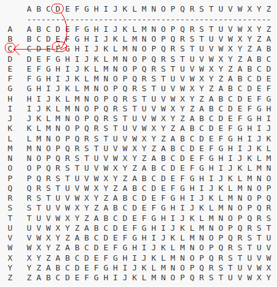

# Task 3 - Beaufort Encryption #
Algoritmul de criptare Beaufort pleacă de la un string în clar (numit și plain text)
și un string secundar numit cheie și obține un text criptat, de lungime identică cu string-ul în clar,
prin înlocuirea caracter cu caracter a literelor din textul inițial.
Spre exemplu, să zicem că vrem să criptăm textul `DEFENDTHEEASTWALLOFTHECASTLE`, utilizând cheia
`FORTIFICATION`.

Regula după care se face înlocuirea folosește o matrice de caractere, numită *tabula recta*,
în care fiecare linie și fiecare coloană au asociate câte o literă a alfabetului limbii engleze.
Aceasta are formatul de mai jos:


Criptarea fiecărui caracter se realizează aplicând următorii pași:
- asociem fiecărui caracter din textul în clar un caracter din cheie,
repetând cheia pentru a acoperi tot string-ul inițial
```
DEFENDTHEEASTWALLOFTHECASTLE
FORTIFICATIONFORTIFICATIONFO
```
- mergem în `tabula recta` pe coloana asociată literei pe care vrem să o criptăm
- coborâm pe această coloană până când găsim litera asociată din cheie
- litera asociată liniei pe care am ajuns reprezintă caracterul criptat  
Pentru caracterul `D`:



Criptând fiecare caracter folosind pașii de mai sus, obținem string-ul cripta. Pe exemplul nostru:
```
CKMPVCPVWPIWUJOGIUAPVWRIWUUK
```

Pentru acest task, va trebui să implementați în fișierul `beaufort.asm` funcția
`beaufort()` care criptează un string în clar folosind metoda descrisă mai sus.
Antetul funcției este:
```
beaufort(int len_plain, char *plain, int len_key, char *key, char tabula_recta[26][26], char *enc)
```
Semnificația argumentelor este:
- **len_plain** și **plain**: dimensiunea textului în clar și string-ul în clar (adresa primului element)
- **len_key** și **key**: dimensiunea cheii și string-ul care reprezintă cheia (adresa primului element)
- **tabula_recta**: o matrice (**alocată static**) de 26 X 26 de caractere ale limbii engleze, cu conținutul din figurile de mai sus
- **enc**: adresa la care va trebui să scrieți textul criptat 

**Note**
În funcție de cum considerați că vă e mai ușor, puteți evita utilizarea argumentului *char tabula_recta[26][26]*, utilizând anumite corelări logice între linia și coloana matricii și conținutul ei. Ambele metode de rezolvare vor fi considerate la fel de corecte :)