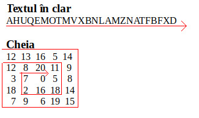

# Task 4 - Spiral Encryption #
O criptare prin substituție (în care înlocuim caracter cu caracter literele din
textul în clar) e cu atât mai eficientă cu cât unui atacator îi e mai greu să
decodifice mesajul inițial, chiar dacă are acces la cheie și la mesajul criptat.
Pentru asta, putem alege moduri cât mai "ezoterice" de utilizare a cheii, iar
*spiral encryption* e un algoritm care face tocmai acest lucru.

Vom pleca de la un text în clar de dimensiune N ^ 2. Cheia în acest caz va fi o
matrice de întregi de dimensiune N * N. Un caracter din textul în clar va fi criptat
adunând la codul său ASCII valoarea întreagă din cheie care îi corespunde. Spre exemplu,
dacă pentru caracterul `A` avem asociată în cheie valoarea 2, caracterul criptat va fi `C`.
De asemenea, dacă avem caracterul `Z` cu cheia asociată 1, caracterul criptat va fi `[`.

Partea specială la acest algoritm este modul în care asociem caracterelor din textul plain
valori din cheie. Pentru asta, vom parcurge textul în clar secvențial (de la primul la
ultimul caracter), iar în același timp vom parcurge cheia în spirală, similar cu figura de mai
jos:



Astfel, ținând cont de dimensiunea matricii care reprezintă cheia și de dimensiunea textului (mereu vor fi corelate astfel încât numărul de elemente din matrice să fie
egal cu numărul de litere din text) obținem un întregul text criptat.

Pe exemplul de mai sus, rezultatul va fi:
```
MUeVSVWb\i^KU^DYbbLYXRH_D
```

Sarcina voastră este să completați funcția `spiral()` din fișierul `spiral.asm`,
astfel încât aceasta să cripteze un text în clar cu ajutorul unei chei date, folosind algoritmul prezentat mai sus. Antetul funcției este:
```
void spiral(int N, char *plain, int key[N][N], char *enc_string)
```
Semnificația argumentelor este:
- **N**: dimensiunea textului în clar va fi N ^ 2, iar dimensiunea cheii va fi N * N
- **plain**: textul în clar, conținând N ^ 2 caractere
- **key**: matricea (**alocată static**) care stochează cheia
- **enc_string**: adresa de start a șirului de caractere în care va trebui să întoarceți rezultatul (textul criptat)
